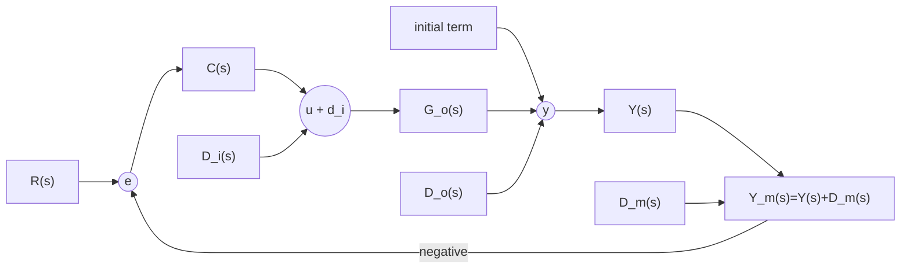

# H∞ 鲁棒控制教程讲义

## 引言

### 阅读目标

本文面向已经熟悉经典反馈控制和线性系统基础的读者，按“性能度量、环路分析、鲁棒性建模、标准合成、工程设计方法”的顺序介绍 $H_\infty$ 鲁棒控制。读完后应能回答以下问题：

1. 为什么 $H_\infty$ 范数适合描述最坏情形性能；
2. 负反馈回路中的参考输入、扰动、噪声和初始条件分别经过哪些闭环通道；
3. 乘性、加性和互质因子不确定性如何转化为鲁棒稳定条件；
4. 标准 $H_\infty$ 合成、混合灵敏度设计和 $H_\infty$ 环路整形分别解决什么问题。

本文只讨论连续时间线性时不变系统。若无特别说明，所有传递函数均假定为有理传递函数，稳定性均指内部稳定。

### 符号约定

| 类别 | 记号 |
|---|---|
| 标量传递函数 | $G(s)$、$K(s)$ |
| MIMO 传递矩阵 | $\mathbf{G}(s)$、$\mathbf{K}(s)$ |
| 向量 | $\boldsymbol{x}$、$\boldsymbol{w}$、$\boldsymbol{z}$ |
| 矩阵 | $\mathbf{A}$、$\mathbf{B}$、$\mathbf{C}$ |
| 单位矩阵 | $\mathbb{1}$ |
| 虚数单位 | $\mathrm{j}$ |
| 频域替换 | $s=\mathrm{j}\omega$ |
| 最大奇异值 | $\bar{\sigma}(\cdot)$ |
| 最小奇异值 | $\underline{\sigma}(\cdot)$ |
| 谱半径 | $\rho(\cdot)$ |

下文中，SISO 公式常用 $G$、$K$、$S$、$T$ 简写；MIMO 公式使用粗正体矩阵记号。

## 0. 信号与系统范数

$H_\infty$ 控制中的“性能”不是笼统的好坏评价，而是闭环系统对外部输入的最大放大能力。为了把性能写成数学问题，需要先定义信号大小和系统大小。

### 0.1 信号范数

对标量信号 $u(t)$，常见范数包括

$$
\|u\|_1
=
\int_{-\infty}^{\infty}|u(t)|\,\mathrm{d}t,
$$

$$
\|u\|_2
=
\left(
\int_{-\infty}^{\infty}u^2(t)\,\mathrm{d}t
\right)^{1/2},
$$

$$
\|u\|_\infty
=
\sup_t |u(t)|.
$$

$\|u\|_1$ 衡量累积绝对量，$\|u\|_2^2$ 衡量能量，$\|u\|_\infty$ 衡量峰值。若 $u(t)$ 是流过 $1\,\Omega$ 电阻的电流，则瞬时功率为 $u^2(t)$，总能量就是 $\|u\|_2^2$。

有些信号不是有限能量信号，但具有稳定的平均功率。此时可定义

$$
\operatorname{pow}(u)
=
\left(
\lim_{T\to\infty}
\frac{1}{2T}
\int_{-T}^{T}u^2(t)\,\mathrm{d}t
\right)^{1/2}.
$$

$\operatorname{pow}(\cdot)$ 不是范数，因为非零信号也可能平均功率为零。它适合描述持续正弦、周期稳态或长期扰动。

几个基本关系需要分清：

$$
\|u\|_2 \lt \infty
\quad\Longrightarrow\quad
\operatorname{pow}(u)=0.
$$

若平均功率存在，且 $\|u\|_\infty\lt\infty$，则

$$
\operatorname{pow}(u)
\le
\|u\|_\infty.
$$

如果 $\|u\|_1\lt\infty$ 且 $\|u\|_\infty\lt\infty$，则

$$
\|u\|_2
\le
\left(
\|u\|_\infty\|u\|_1
\right)^{1/2}.
$$

一个范数有限通常不能推出其他范数有限。选择性能指标前，必须先说明关心的是能量、峰值还是平均功率。

### 0.2 系统范数

对稳定线性时不变系统

$$
y=G*u,
$$

即

$$
y(t)
=
\int_{-\infty}^{\infty}G(t-\tau)u(\tau)\,\mathrm{d}\tau,
$$

记传递函数为 $G(s)$。SISO 情形下，两个常用传递函数范数为

$$
\|G\|_2
=
\left(
\frac{1}{2\pi}
\int_{-\infty}^{\infty}
|G(\mathrm{j}\omega)|^2\,\mathrm{d}\omega
\right)^{1/2},
$$

$$
\|G\|_\infty
=
\sup_\omega |G(\mathrm{j}\omega)|.
$$

若系统稳定，则由 Parseval 定理可得

$$
\|G\|_2
=
\left(
\int_{-\infty}^{\infty}|G(t)|^2\,\mathrm{d}t
\right)^{1/2}.
$$

因此，$H_2$ 范数与冲激响应能量有关；$H_\infty$ 范数是频率响应幅值的峰值。对 MIMO 系统，

$$
\|\mathbf{G}\|_\infty
=
\sup_\omega
\bar{\sigma}\!\left(\mathbf{G}(\mathrm{j}\omega)\right).
$$

有理传递函数的有限性也要提前说明。$\|G\|_2$ 有限通常要求系统严格真有理且无虚轴极点；$\|G\|_\infty$ 有限通常要求系统真有理且无虚轴极点。若存在虚轴极点，某些频率上的响应会无限放大；若直接通道使高频不衰减，$H_2$ 积分也可能发散。

### 0.3 输入输出增益

$H_\infty$ 范数最重要的解释是诱导 $L_2$ 增益。若

$$
\boldsymbol{y}
=
\mathbf{G}\boldsymbol{u},
$$

则

$$
\|\mathbf{G}\|_\infty
=
\sup_{\boldsymbol{u}\ne 0}
\frac{\|\boldsymbol{y}\|_2}{\|\boldsymbol{u}\|_2}.
$$

也就是说，如果

$$
\|\mathbf{G}\|_\infty \lt \gamma,
$$

那么任意有限能量输入都满足

$$
\|\boldsymbol{y}\|_2
\lt
\gamma\|\boldsymbol{u}\|_2.
$$

若闭环中从扰动 $\boldsymbol{w}$ 到性能输出 $\boldsymbol{z}$ 的传递矩阵为 $\mathbf{T}_{zw}$，则

$$
\|\mathbf{T}_{zw}\|_\infty \lt \gamma
$$

表示所有能量有限的扰动进入闭环后，性能输出的能量放大倍数小于 $\gamma$。

对稳定严格真有理系统，若 $u(t)=\delta(t)$，则 $y(t)=G(t)$，所以

$$
\|y\|_2=\|G\|_2,
\qquad
\operatorname{pow}(y)=0.
$$

若 $u(t)=\sin(\omega t)$，稳态输出幅值由该频率处的频率响应决定：

$$
\|y\|_\infty
=
|G(\mathrm{j}\omega)|,
\qquad
\operatorname{pow}(y)
=
\frac{1}{\sqrt{2}}|G(\mathrm{j}\omega)|.
$$

常见诱导增益包括

$$
\sup_{\|u\|_2\le 1}\|y\|_2
=
\|G\|_\infty,
$$

$$
\sup_{\|u\|_2\le 1}\|y\|_\infty
=
\|G\|_2,
$$

$$
\sup_{\|u\|_\infty\le 1}\|y\|_\infty
=
\|G\|_1,
$$

$$
\sup_{\operatorname{pow}(u)\le 1}\operatorname{pow}(y)
=
\|G\|_\infty.
$$

这些关系说明，范数选择取决于扰动的物理性质：能量受限扰动看 $L_2$，幅值受限扰动看 $L_\infty$，持续周期扰动看平均功率，频率已知的正弦扰动直接看 $|G(\mathrm{j}\omega)|$。

### 0.4 $H_\infty$ 与鲁棒控制

$H_\infty$ 范数还有一个重要的代数性质：它对串联系统满足次乘性。若 $\mathbf{G}$、$\mathbf{H}$ 都稳定，则

$$
\|\mathbf{G}\mathbf{H}\|_\infty
\le
\|\mathbf{G}\|_\infty\|\mathbf{H}\|_\infty.
$$

这正好匹配小增益型鲁棒性分析。若一个不确定块的增益小于 $1$，另一个闭环通道的增益也足够小，两者相乘后不会形成能量放大超过 $1$ 的闭环循环。

在控制设计中，常见分工是：

1. 用 $H_2$ 型指标描述能量平均意义下的响应；
2. 用 $H_\infty$ 型指标描述最坏频率、最坏输入方向下的响应；
3. 在鲁棒控制中优先使用 $H_\infty$ 范数，因为模型误差和扰动通常不能预先指定方向。

## 1. 负反馈环路分析

本节讨论负反馈回路中的信号通道。核心问题是：参考输入、测量噪声、输入扰动、输出扰动和初始条件进入闭环以后，分别经过哪些传递函数到达输出、误差和控制输入。

### 1.1 单自由度负反馈回路

考虑 SISO 名义对象 $G_\mathrm{o}(s)$ 和控制器 $C(s)$：

$$
G_\mathrm{o}(s)
=
\frac{B_\mathrm{o}(s)}{A_\mathrm{o}(s)},
\qquad
C(s)
=
\frac{P(s)}{L(s)}.
$$

单自由度负反馈回路的信号包括：

| 信号 | 含义 |
|---|---|
| $R(s)$ | 参考输入 |
| $E(s)$ | 误差信号 |
| $U(s)$ | 控制输入 |
| $Y(s)$ | 对象输出 |
| $D_\mathrm{i}(s)$ | 输入扰动，进入对象输入端 |
| $D_\mathrm{o}(s)$ | 输出扰动，直接叠加到对象输出端 |
| $D_\mathrm{m}(s)$ | 测量噪声，叠加到反馈测量信号 |
| $f(s,\boldsymbol{x}_0)/A_\mathrm{o}(s)$ | 由对象初始条件引起的输出项 |

信号关系可用下图表示：

对应的基本方程为

$$
Y
=
G_\mathrm{o}U
+
D_\mathrm{o}
+
G_\mathrm{o}D_\mathrm{i}
+
\frac{f(s,\boldsymbol{x}_0)}{A_\mathrm{o}},
$$

$$
U
=
C(R-Y-D_\mathrm{m}).
$$

把第二式代入第一式并整理，闭环所有通道都会出现同一个分母：

$$
1+G_\mathrm{o}C.
$$

这就是环路函数分析的核心。

### 1.2 四个名义灵敏度函数

定义四个名义闭环函数：

$$
T_\mathrm{o}
=
\frac{G_\mathrm{o}C}{1+G_\mathrm{o}C}
=
\frac{B_\mathrm{o}P}
{A_\mathrm{o}L+B_\mathrm{o}P},
$$

$$
S_\mathrm{o}
=
\frac{1}{1+G_\mathrm{o}C}
=
\frac{A_\mathrm{o}L}
{A_\mathrm{o}L+B_\mathrm{o}P},
$$

$$
S_\mathrm{io}
=
\frac{G_\mathrm{o}}{1+G_\mathrm{o}C}
=
\frac{B_\mathrm{o}L}
{A_\mathrm{o}L+B_\mathrm{o}P},
$$

$$
S_\mathrm{uo}
=
\frac{C}{1+G_\mathrm{o}C}
=
\frac{A_\mathrm{o}P}
{A_\mathrm{o}L+B_\mathrm{o}P}.
$$

| 函数 | 名称 | 主要作用 |
|---|---|---|
| $T_\mathrm{o}$ | 名义互补灵敏度 | 参考跟踪、测量噪声传递 |
| $S_\mathrm{o}$ | 名义灵敏度 | 误差、输出扰动、低频抗扰 |
| $S_\mathrm{io}$ | 名义输入扰动灵敏度 | 输入扰动到输出 |
| $S_\mathrm{uo}$ | 名义控制灵敏度 | 参考、噪声、输出扰动到控制输入 |

它们满足

$$
S_\mathrm{o}+T_\mathrm{o}=1,
$$

$$
S_\mathrm{io}
=
S_\mathrm{o}G_\mathrm{o}
=
\frac{T_\mathrm{o}}{C},
$$

$$
S_\mathrm{uo}
=
S_\mathrm{o}C
=
\frac{T_\mathrm{o}}{G_\mathrm{o}}.
$$

这些关系说明各通道不是彼此独立的。只要 $C$ 确定，$S_\mathrm{o}$、$T_\mathrm{o}$、$S_\mathrm{io}$、$S_\mathrm{uo}$ 就同时确定。

### 1.3 输出通道

由基本方程可得

$$
Y
=
T_\mathrm{o}R
-
T_\mathrm{o}D_\mathrm{m}
+
S_\mathrm{o}D_\mathrm{o}
+
S_\mathrm{io}D_\mathrm{i}
+
S_\mathrm{o}\frac{f(s,\boldsymbol{x}_0)}{A_\mathrm{o}}.
$$

各输入到输出的传递函数为：

| 输入 | 到 $Y$ 的通道 | 解释 |
|---|---|---|
| $R$ | $T_\mathrm{o}$ | 参考跟踪由互补灵敏度决定 |
| $D_\mathrm{m}$ | $-T_\mathrm{o}$ | 测量噪声通过互补灵敏度进入输出 |
| $D_\mathrm{o}$ | $S_\mathrm{o}$ | 输出扰动由灵敏度抑制 |
| $D_\mathrm{i}$ | $S_\mathrm{io}=G_\mathrm{o}S_\mathrm{o}$ | 输入扰动先经过对象，再受闭环修正 |
| $f/A_\mathrm{o}$ | $S_\mathrm{o}$ | 初始条件响应由闭环极点改变 |

如果希望低频参考跟踪好，需要低频 $T_\mathrm{o}\approx 1$，等价于低频 $S_\mathrm{o}\approx 0$。若希望高频测量噪声不被放大，需要高频 $T_\mathrm{o}$ 小。

### 1.4 控制输入通道

控制输入满足

$$
U
=
S_\mathrm{uo}R
-
S_\mathrm{uo}D_\mathrm{m}
-
S_\mathrm{uo}D_\mathrm{o}
-
T_\mathrm{o}D_\mathrm{i}
-
S_\mathrm{uo}\frac{f(s,\boldsymbol{x}_0)}{A_\mathrm{o}}.
$$

因此

| 输入 | 到 $U$ 的通道 |
|---|---|
| $R$ | $S_\mathrm{uo}$ |
| $D_\mathrm{m}$ | $-S_\mathrm{uo}$ |
| $D_\mathrm{o}$ | $-S_\mathrm{uo}$ |
| $D_\mathrm{i}$ | $-T_\mathrm{o}$ |
| $f/A_\mathrm{o}$ | $-S_\mathrm{uo}$ |

这些式子说明，只看输出性能是不够的。为了让 $Y$ 对扰动不敏感，控制器可能让 $U$ 变得很大，导致执行器饱和、功率过高或高频噪声进入控制输入。设计时必须同时检查输出性能和控制努力。

### 1.5 误差信号通道

误差信号为

$$
E
=
R-Y-D_\mathrm{m}.
$$

代入输出表达式可得

$$
E
=
S_\mathrm{o}R
-
S_\mathrm{o}D_\mathrm{m}
-
S_\mathrm{o}D_\mathrm{o}
-
S_\mathrm{io}D_\mathrm{i}
-
S_\mathrm{o}\frac{f(s,\boldsymbol{x}_0)}{A_\mathrm{o}}.
$$

参考输入到误差的通道为 $S_\mathrm{o}$。这也是“灵敏度函数”名称的来源之一：它衡量误差对参考和扰动的敏感程度。

低频 $S_\mathrm{o}$ 小，意味着低频参考跟踪误差小、输出扰动影响小。若某个频率处 $S_\mathrm{o}$ 有峰值，则该频率附近的误差和扰动影响会被放大。

### 1.6 两自由度回路

单自由度回路中，控制器 $C$ 同时决定参考响应和扰动响应。若希望单独调整参考响应，可以加入参考滤波器 $H(s)$：

$$
U=C(HR-Y-D_\mathrm{m}).
$$

输出变为

$$
Y
=
T_\mathrm{o}H R
-
T_\mathrm{o}D_\mathrm{m}
+
S_\mathrm{o}D_\mathrm{o}
+
S_\mathrm{io}D_\mathrm{i}
+
S_\mathrm{o}\frac{f(s,\boldsymbol{x}_0)}{A_\mathrm{o}}.
$$

控制输入变为

$$
U
=
S_\mathrm{uo}H R
-
S_\mathrm{uo}D_\mathrm{m}
-
S_\mathrm{uo}D_\mathrm{o}
-
T_\mathrm{o}D_\mathrm{i}
-
S_\mathrm{uo}\frac{f(s,\boldsymbol{x}_0)}{A_\mathrm{o}}.
$$

把 $Y$、$E$、$U$ 三组表达式合在一起，可以得到通道表。一自由度回路只需令 $H=1$。

| 外部输入 | 到输出 $Y$ | 到误差 $E$ | 到控制输入 $U$ |
|---|---:|---:|---:|
| $R$ | $T_\mathrm{o}H$ | $S_\mathrm{o}H$ | $S_\mathrm{uo}H$ |
| $D_\mathrm{m}$ | $-T_\mathrm{o}$ | $-S_\mathrm{o}$ | $-S_\mathrm{uo}$ |
| $D_\mathrm{o}$ | $S_\mathrm{o}$ | $-S_\mathrm{o}$ | $-S_\mathrm{uo}$ |
| $D_\mathrm{i}$ | $S_\mathrm{io}$ | $-S_\mathrm{io}$ | $-T_\mathrm{o}$ |
| $f/A_\mathrm{o}$ | $S_\mathrm{o}$ | $-S_\mathrm{o}$ | $-S_\mathrm{uo}$ |

$H$ 只改变参考输入通道，不改变扰动和噪声通道。参考跟踪形状可以用 $H$ 再调整，但扰动抑制、噪声抑制和控制努力仍主要由反馈控制器 $C$ 决定。

### 1.7 环路设计折中

由

$$
S_\mathrm{o}+T_\mathrm{o}=1
$$

可知，$S_\mathrm{o}$ 与 $T_\mathrm{o}$ 不能在同一频段同时任意小。

低频通常希望

$$
|G_\mathrm{o}(\mathrm{j}\omega)C(\mathrm{j}\omega)|\gg 1,
$$

此时

$$
S_\mathrm{o}
=
\frac{1}{1+G_\mathrm{o}C}
\approx 0,
\qquad
T_\mathrm{o}\approx 1.
$$

这带来较好的跟踪和输出扰动抑制。

高频通常希望

$$
|G_\mathrm{o}(\mathrm{j}\omega)C(\mathrm{j}\omega)|\ll 1,
$$

此时

$$
T_\mathrm{o}
=
\frac{G_\mathrm{o}C}{1+G_\mathrm{o}C}
\approx 0.
$$

这有利于抑制测量噪声和高频模型误差。环路设计的核心原则可以概括为

$$
\boxed{
\text{低频让开环大以保证性能，高频让开环小以保证鲁棒性和噪声抑制。}
}
$$

混合灵敏度 $H_\infty$ 和 $H_\infty$ 环路整形，都是把这个折中系统化的方法。

## 2. 不确定性与鲁棒性

真实对象不会完全等于数学模型。鲁棒控制不把对象看成一个点，而把对象看成一个集合。控制器需要对集合中的所有允许对象保持稳定，必要时还要保持性能。

### 2.1 结构化与非结构化不确定性

结构化不确定性保留明确参数。例如

$$
P_a(s)
=
\frac{1}{s^2+a s+1},
\qquad
a\in[a_{\min},a_{\max}].
$$

这里的不确定性就是标量参数 $a$。

非结构化不确定性不逐项描述物理参数，而用范数有界扰动块包络模型误差。最常用的是乘性不确定性：

$$
\tilde{P}
=
(1+\Delta W_2)P,
\qquad
\|\Delta\|_\infty \le 1.
$$

其中 $P$ 是名义对象，$\tilde{P}$ 是真实对象，$W_2$ 是稳定权重，$\Delta$ 是未知稳定扰动。这个模型等价于

$$
\frac{\tilde{P}(\mathrm{j}\omega)}
{P(\mathrm{j}\omega)}
-1
=
\Delta(\mathrm{j}\omega)W_2(\mathrm{j}\omega).
$$

若 $\|\Delta\|_\infty\le 1$，则

$$
\left|
\frac{\tilde{P}(\mathrm{j}\omega)}
{P(\mathrm{j}\omega)}
-1
\right|
\le
|W_2(\mathrm{j}\omega)|.
$$

因此，$W_2$ 给出了模型误差的频率包络。高频未建模动态通常更多，所以 $|W_2(\mathrm{j}\omega)|$ 往往随频率增大。

常见不确定性模型及其对应的闭环函数如下。

$$
\begin{array}{lll}
\text{乘性：} & \tilde{P}=(1+\Delta W_2)P, & \text{涉及 } T,\\
\text{加性：} & \tilde{P}=P+\Delta W_2, & \text{涉及 } CS,\\
\text{输入端反馈型：} & \tilde{P}=P(1+\Delta W_2P)^{-1}, & \text{涉及 } PS,\\
\text{输出端反馈型：} & \tilde{P}=P(1+\Delta W_2)^{-1}, & \text{涉及 } S.
\end{array}
$$

这些模型都可能保守，但它们把复杂模型误差变成了可以计算的范数问题。

典型权重来源包括：

1. 频响实验。对一族频率响应 $\tilde{P}(\mathrm{j}\omega)$，在每个频率上计算相对误差，再选择稳定权重 $W_2(s)$ 包络这些误差。
2. 未建模时滞。若真实对象含有小延迟 $\mathrm{e}^{-\tau s}$，而名义模型忽略它，则相对误差近似为 $\mathrm{e}^{-\tau s}-1$。可用高通型权重描述低频小、高频大的误差。
3. 参数不确定性。例如 $\tilde{P}(s)=k/(s-2)$，$k\in[0.1,10]$。若取名义值 $k_0=5.05$，则可用常数权重 $W_2=4.95/5.05$ 包络相对误差。

### 2.2 鲁棒稳定

鲁棒稳定指同一个控制器对整个对象集合都能保证闭环内部稳定。

以乘性不确定性为例，设名义闭环已内部稳定，且

$$
S
=
\frac{1}{1+PC},
\qquad
T
=
\frac{PC}{1+PC}.
$$

真实对象为

$$
\tilde{P}
=
(1+\Delta W_2)P,
\qquad
\|\Delta\|_\infty \le 1.
$$

闭环特征因子可分解为

$$
1+(1+\Delta W_2)PC
=
(1+PC)(1+\Delta W_2T).
$$

名义部分 $1+PC$ 已经稳定。剩下要保证的是

$$
1+\Delta W_2T
$$

不会引入不稳定性。由小增益定理，若

$$
\|W_2T\|_\infty \lt 1,
$$

则对所有 $\|\Delta\|_\infty\le 1$ 的扰动都鲁棒稳定。

若允许 $\|\Delta\|_\infty\le \beta$，则

$$
\|\beta W_2T\|_\infty \lt 1.
$$

可容许的不确定性尺度上界为

$$
\beta_\mathrm{sup}
=
\frac{1}{\|W_2T\|_\infty}.
$$

这就是稳定裕度在该不确定性模型下的含义。

### 2.3 常见鲁棒稳定条件

若名义闭环已内部稳定，则典型鲁棒稳定充分条件可写成：

$$
\begin{array}{lll}
\tilde{P}=(1+\Delta W_2)P
&\Longrightarrow&
\|W_2T\|_\infty \lt 1,\\[1mm]
\tilde{P}=P+\Delta W_2
&\Longrightarrow&
\|W_2CS\|_\infty \lt 1,\\[1mm]
\tilde{P}=P(1+\Delta W_2P)^{-1}
&\Longrightarrow&
\|W_2PS\|_\infty \lt 1,\\[1mm]
\tilde{P}=P(1+\Delta W_2)^{-1}
&\Longrightarrow&
\|W_2S\|_\infty \lt 1.
\end{array}
$$

直观上，不确定性放在对象的哪一侧、采用哪一种结构，就会激发不同闭环通道。$H_\infty$ 鲁棒设计的任务，是让这些被激发的通道足够小。

### 2.4 鲁棒性能

鲁棒稳定只要求稳定。鲁棒性能要求所有允许对象不仅稳定，而且满足性能指标。

仍以乘性不确定性为例。名义性能设为

$$
\|W_1S\|_\infty \lt 1.
$$

当对象变成 $\tilde{P}=(1+\Delta W_2)P$ 时，灵敏度变成

$$
\tilde{S}
=
\frac{S}{1+\Delta W_2T}.
$$

因此鲁棒性能要求

$$
\left\|
\frac{W_1S}{1+\Delta W_2T}
\right\|_\infty
\lt
1,
\qquad
\forall\,\|\Delta\|_\infty\le 1.
$$

利用最坏相位方向，可以得到 SISO 乘性不确定性下的经典判据：

$$
\boxed{
\left\|
|W_1S|+|W_2T|
\right\|_\infty
\lt
1.
}
$$

这比单独满足

$$
\|W_1S\|_\infty \lt 1,
\qquad
\|W_2T\|_\infty \lt 1
$$

更强。后者只说明名义性能和鲁棒稳定分别成立；前者说明二者在每个频率上同时留有足够余量。

若性能权重 $W_1$ 固定，而允许 $W_2$ 的不确定性尺度变化，可定义鲁棒性能意义下的余量：

$$
\alpha_{\min}
=
\left\|
\frac{W_1S}{1-|W_2T|}
\right\|_\infty,
$$

$$
\beta_{\max}
=
\left\|
\frac{W_2T}{1-|W_1S|}
\right\|_\infty^{-1}.
$$

$\alpha_{\min}$ 可理解为在给定不确定性下，性能权重还需要整体放松多少；$\beta_{\max}$ 可理解为在给定性能要求下，不确定性权重还能整体放大多少。

### 2.5 三种折中形式

令

$$
x_1=|W_1S|,
\qquad
x_2=|W_2T|.
$$

可以比较三种条件：

$$
\text{名义性能加鲁棒稳定：}\qquad
\|\max(x_1,x_2)\|_\infty \lt 1,
$$

$$
\text{鲁棒性能：}\qquad
\|x_1+x_2\|_\infty \lt 1,
$$

$$
\text{混合灵敏度常用欧氏折中：}\qquad
\left\|
(x_1^2+x_2^2)^{1/2}
\right\|_\infty
\lt
1.
$$

欧氏形式处于前两者之间。它不是最保守的鲁棒性能判据，但适合写成标准 $H_\infty$ 合成问题，因此在工程设计中很常见。

## 3. 标准 H∞ 合成

标准 $H_\infty$ 合成是统一框架。它不直接规定控制目标，而是要求把目标写成从外部输入 $\boldsymbol{w}$ 到性能输出 $\boldsymbol{z}$ 的闭环传递矩阵。

核心问题是

$$
\boxed{
\text{设计 } \mathbf{K} \text{，使闭环内部稳定，并使 }
\|\mathbf{T}_{zw}\|_\infty \lt \gamma.
}
$$

### 3.1 广义被控对象

广义被控对象 $\mathbf{P}$ 把被控对象、权重、外部扰动、参考输入、噪声、控制输入和性能输出都放进一个系统：

$$
\begin{bmatrix}
\boldsymbol{z}\\
\boldsymbol{y}
\end{bmatrix}
=
\mathbf{P}
\begin{bmatrix}
\boldsymbol{w}\\
\boldsymbol{u}
\end{bmatrix}.
$$

其中：

| 变量 | 含义 |
|---|---|
| $\boldsymbol{w}$ | 外部输入，包括参考、扰动、噪声等 |
| $\boldsymbol{u}$ | 控制输入 |
| $\boldsymbol{z}$ | 性能输出，是希望压小的信号 |
| $\boldsymbol{y}$ | 测量输出，是控制器能看到的信号 |

分块写作

$$
\mathbf{P}
=
\begin{bmatrix}
\mathbf{P}_{11} & \mathbf{P}_{12}\\
\mathbf{P}_{21} & \mathbf{P}_{22}
\end{bmatrix},
$$

即

$$
\boldsymbol{z}
=
\mathbf{P}_{11}\boldsymbol{w}
+
\mathbf{P}_{12}\boldsymbol{u},
$$

$$
\boldsymbol{y}
=
\mathbf{P}_{21}\boldsymbol{w}
+
\mathbf{P}_{22}\boldsymbol{u}.
$$

控制器满足

$$
\boldsymbol{u}
=
\mathbf{K}\boldsymbol{y}.
$$

若互联适定，则

$$
\boldsymbol{y}
=
(\mathbb{1}-\mathbf{P}_{22}\mathbf{K})^{-1}
\mathbf{P}_{21}\boldsymbol{w}.
$$

代回性能输出，得到闭环传递矩阵

$$
\boxed{
\mathbf{T}_{zw}
=
F_l(\mathbf{P},\mathbf{K})
=
\mathbf{P}_{11}
+
\mathbf{P}_{12}\mathbf{K}
(\mathbb{1}-\mathbf{P}_{22}\mathbf{K})^{-1}
\mathbf{P}_{21}.
}
$$

$F_l(\mathbf{P},\mathbf{K})$ 称为下线性分式变换。标准 $H_\infty$ 合成问题写成

$$
\boxed{
\min_{\mathbf{K}}
\|F_l(\mathbf{P},\mathbf{K})\|_\infty
}
$$

并要求闭环内部稳定。给定 $\gamma$ 时，次优问题为

$$
\boxed{
\|F_l(\mathbf{P},\mathbf{K})\|_\infty
\lt
\gamma.
}
$$

### 3.2 状态空间形式

连续时间广义对象写作

$$
\begin{aligned}
\dot{\boldsymbol{x}}
&=
\mathbf{A}\boldsymbol{x}
+
\mathbf{B}_1\boldsymbol{w}
+
\mathbf{B}_2\boldsymbol{u},\\
\boldsymbol{z}
&=
\mathbf{C}_1\boldsymbol{x}
+
\mathbf{D}_{11}\boldsymbol{w}
+
\mathbf{D}_{12}\boldsymbol{u},\\
\boldsymbol{y}
&=
\mathbf{C}_2\boldsymbol{x}
+
\mathbf{D}_{21}\boldsymbol{w}
+
\mathbf{D}_{22}\boldsymbol{u}.
\end{aligned}
$$

也可写成

$$
\begin{bmatrix}
\dot{\boldsymbol{x}}\\
\boldsymbol{z}\\
\boldsymbol{y}
\end{bmatrix}
=
\begin{bmatrix}
\mathbf{A} & \mathbf{B}_1 & \mathbf{B}_2\\
\mathbf{C}_1 & \mathbf{D}_{11} & \mathbf{D}_{12}\\
\mathbf{C}_2 & \mathbf{D}_{21} & \mathbf{D}_{22}
\end{bmatrix}
\begin{bmatrix}
\boldsymbol{x}\\
\boldsymbol{w}\\
\boldsymbol{u}
\end{bmatrix}.
$$

动态输出反馈控制器为

$$
\begin{aligned}
\dot{\boldsymbol{x}}_\mathrm{K}
&=
\mathbf{A}_\mathrm{K}\boldsymbol{x}_\mathrm{K}
+
\mathbf{B}_\mathrm{K}\boldsymbol{y},\\
\boldsymbol{u}
&=
\mathbf{C}_\mathrm{K}\boldsymbol{x}_\mathrm{K}
+
\mathbf{D}_\mathrm{K}\boldsymbol{y}.
\end{aligned}
$$

合成目标是选择 $\mathbf{A}_\mathrm{K}$、$\mathbf{B}_\mathrm{K}$、$\mathbf{C}_\mathrm{K}$、$\mathbf{D}_\mathrm{K}$，使整个闭环内部稳定，并满足 $\|\mathbf{T}_{zw}\|_\infty\lt\gamma$。

### 3.3 有界实引理

考虑系统

$$
\begin{aligned}
\dot{\boldsymbol{x}}
&=
\mathbf{A}\boldsymbol{x}
+
\mathbf{B}\boldsymbol{w},\\
\boldsymbol{z}
&=
\mathbf{C}\boldsymbol{x}
+
\mathbf{D}\boldsymbol{w}.
\end{aligned}
$$

传递矩阵为

$$
\mathbf{G}(s)
=
\mathbf{C}(s\mathbb{1}-\mathbf{A})^{-1}\mathbf{B}
+
\mathbf{D}.
$$

希望满足

$$
\|\mathbf{G}\|_\infty \lt \gamma.
$$

取二次型存储函数

$$
V(\boldsymbol{x})
=
\boldsymbol{x}^\top\mathbf{X}\boldsymbol{x},
\qquad
\mathbf{X}=\mathbf{X}^\top\gt 0.
$$

若对所有非零 $(\boldsymbol{x},\boldsymbol{w})$ 有

$$
\dot{V}
+
\boldsymbol{z}^\top\boldsymbol{z}
-
\gamma^2\boldsymbol{w}^\top\boldsymbol{w}
\lt
0,
$$

沿时间积分得到

$$
\int_0^\infty
\boldsymbol{z}^\top\boldsymbol{z}\,\mathrm{d}t
\lt
\gamma^2
\int_0^\infty
\boldsymbol{w}^\top\boldsymbol{w}\,\mathrm{d}t.
$$

因此从 $\boldsymbol{w}$ 到 $\boldsymbol{z}$ 的 $L_2$ 增益小于 $\gamma$。

把系统方程代入，可得一种常用 LMI 形式：

$$
\boxed{
\begin{bmatrix}
\mathbf{A}^\top\mathbf{X}+\mathbf{X}\mathbf{A}
&
\mathbf{X}\mathbf{B}
&
\mathbf{C}^\top\\
\mathbf{B}^\top\mathbf{X}
&
-\gamma^2\mathbb{1}
&
\mathbf{D}^\top\\
\mathbf{C}
&
\mathbf{D}
&
-\mathbb{1}
\end{bmatrix}
\lt
0.
}
$$

这就是连续时间有界实引理的一种常用形式。它说明频域的 $H_\infty$ 范数约束可以转化为状态空间矩阵不等式。

### 3.4 状态反馈情形

先考虑状态可测：

$$
\dot{\boldsymbol{x}}
=
\mathbf{A}\boldsymbol{x}
+
\mathbf{B}_1\boldsymbol{w}
+
\mathbf{B}_2\boldsymbol{u},
$$

$$
\boldsymbol{z}
=
\mathbf{C}_1\boldsymbol{x}
+
\mathbf{D}_{12}\boldsymbol{u}.
$$

假设

$$
\mathbf{D}_{12}^\top\mathbf{D}_{12}
=
\mathbb{1},
\qquad
\mathbf{D}_{12}^\top\mathbf{C}_1
=
0.
$$

取

$$
V(\boldsymbol{x})
=
\boldsymbol{x}^\top\mathbf{X}\boldsymbol{x}.
$$

需要

$$
\dot{V}
+
\boldsymbol{z}^\top\boldsymbol{z}
-
\gamma^2\boldsymbol{w}^\top\boldsymbol{w}
\lt
0.
$$

展开有

$$
\begin{aligned}
\dot{V}
&=
\boldsymbol{x}^\top
(\mathbf{A}^\top\mathbf{X}+\mathbf{X}\mathbf{A})
\boldsymbol{x}
+
2\boldsymbol{x}^\top\mathbf{X}\mathbf{B}_1\boldsymbol{w}
+
2\boldsymbol{x}^\top\mathbf{X}\mathbf{B}_2\boldsymbol{u},\\
\boldsymbol{z}^\top\boldsymbol{z}
&=
\boldsymbol{x}^\top\mathbf{C}_1^\top\mathbf{C}_1\boldsymbol{x}
+
\boldsymbol{u}^\top\boldsymbol{u}.
\end{aligned}
$$

对 $\boldsymbol{u}$ 最小化

$$
2\boldsymbol{x}^\top\mathbf{X}\mathbf{B}_2\boldsymbol{u}
+
\boldsymbol{u}^\top\boldsymbol{u}
$$

得到

$$
\boldsymbol{u}^\star
=
-\mathbf{B}_2^\top\mathbf{X}\boldsymbol{x}.
$$

对扰动 $\boldsymbol{w}$ 最大化

$$
2\boldsymbol{x}^\top\mathbf{X}\mathbf{B}_1\boldsymbol{w}
-
\gamma^2\boldsymbol{w}^\top\boldsymbol{w}
$$

得到

$$
\boldsymbol{w}^\star
=
\gamma^{-2}\mathbf{B}_1^\top\mathbf{X}\boldsymbol{x}.
$$

代回即可得到 Riccati 不等式

$$
\mathbf{A}^\top\mathbf{X}
+
\mathbf{X}\mathbf{A}
+
\mathbf{C}_1^\top\mathbf{C}_1
-
\mathbf{X}\mathbf{B}_2\mathbf{B}_2^\top\mathbf{X}
+
\gamma^{-2}\mathbf{X}\mathbf{B}_1\mathbf{B}_1^\top\mathbf{X}
\lt
0.
$$

对应 Riccati 方程为

$$
\boxed{
\mathbf{A}^\top\mathbf{X}
+
\mathbf{X}\mathbf{A}
+
\mathbf{C}_1^\top\mathbf{C}_1
+
\mathbf{X}
\left(
\gamma^{-2}\mathbf{B}_1\mathbf{B}_1^\top
-
\mathbf{B}_2\mathbf{B}_2^\top
\right)
\mathbf{X}
=
0.
}
$$

这说明 $H_\infty$ 合成具有最小最大结构：

$$
\boxed{
\min_{\boldsymbol{u}}\max_{\boldsymbol{w}}
\left(
\dot{V}
+
\boldsymbol{z}^\top\boldsymbol{z}
-
\gamma^2\boldsymbol{w}^\top\boldsymbol{w}
\right)
\lt
0.
}
$$

控制器压低性能输出，扰动沿最坏方向放大性能输出。这是 $H_\infty$ 与普通二次型最优控制的重要区别。

### 3.5 输出反馈 Riccati 解法

实际系统中状态通常不可全测。控制器只能使用测量输出 $\boldsymbol{y}$ 产生

$$
\boldsymbol{u}
=
\mathbf{K}(s)\boldsymbol{y}.
$$

在常见标准化条件下，

$$
\mathbf{D}_{11}=0,
\qquad
\mathbf{D}_{22}=0,
$$

$$
\mathbf{D}_{12}^\top\mathbf{D}_{12}
=
\mathbb{1},
\qquad
\mathbf{D}_{12}^\top\mathbf{C}_1
=
0,
$$

$$
\mathbf{D}_{21}\mathbf{D}_{21}^\top
=
\mathbb{1},
\qquad
\mathbf{B}_1\mathbf{D}_{21}^\top
=
0.
$$

同时要求

$$
(\mathbf{A},\mathbf{B}_2)\ \text{可稳定},
\qquad
(\mathbf{C}_2,\mathbf{A})\ \text{可检测}.
$$

给定 $\gamma$，输出反馈 $H_\infty$ 次优问题需要求解两个 Riccati 方程。

控制 Riccati 方程：

$$
\boxed{
\mathbf{A}^\top\mathbf{X}
+
\mathbf{X}\mathbf{A}
+
\mathbf{C}_1^\top\mathbf{C}_1
+
\mathbf{X}
\left(
\gamma^{-2}\mathbf{B}_1\mathbf{B}_1^\top
-
\mathbf{B}_2\mathbf{B}_2^\top
\right)
\mathbf{X}
=
0.
}
$$

估计 Riccati 方程：

$$
\boxed{
\mathbf{A}\mathbf{Y}
+
\mathbf{Y}\mathbf{A}^\top
+
\mathbf{B}_1\mathbf{B}_1^\top
+
\mathbf{Y}
\left(
\gamma^{-2}\mathbf{C}_1^\top\mathbf{C}_1
-
\mathbf{C}_2^\top\mathbf{C}_2
\right)
\mathbf{Y}
=
0.
}
$$

其中

$$
\mathbf{X}=\mathbf{X}^\top\ge 0,
\qquad
\mathbf{Y}=\mathbf{Y}^\top\ge 0.
$$

还需要满足耦合条件

$$
\boxed{
\rho(\mathbf{X}\mathbf{Y})
\lt
\gamma^2.
}
$$

这里 $\rho(\cdot)$ 是谱半径。该条件说明控制方向和估计方向不能相互冲突得太严重。

定义

$$
\mathbf{F}
=
-\mathbf{B}_2^\top\mathbf{X},
\qquad
\mathbf{L}
=
-\mathbf{Y}\mathbf{C}_2^\top,
$$

$$
\mathbf{Z}
=
\left(
\mathbb{1}
-
\gamma^{-2}\mathbf{Y}\mathbf{X}
\right)^{-1}.
$$

一个中心控制器可写为

$$
\boxed{
\begin{aligned}
\dot{\hat{\boldsymbol{x}}}
&=
\left(
\mathbf{A}
+
\gamma^{-2}\mathbf{B}_1\mathbf{B}_1^\top\mathbf{X}
+
\mathbf{B}_2\mathbf{F}
+
\mathbf{Z}\mathbf{L}\mathbf{C}_2
\right)
\hat{\boldsymbol{x}}
-
\mathbf{Z}\mathbf{L}\boldsymbol{y},\\
\boldsymbol{u}
&=
\mathbf{F}\hat{\boldsymbol{x}}.
\end{aligned}
}
$$

它看起来像“状态估计器 + 状态反馈”，但不是 Kalman 滤波加 LQR，而是为最坏情形 $H_\infty$ 增益约束构造的输出反馈控制器。

### 3.6 Hamilton 条件

Riccati 方程的稳定化解通常通过 Hamilton 矩阵判断。对 $\mathbf{X}$ 方程，

$$
\mathcal{H}_X
=
\begin{bmatrix}
\mathbf{A}
&
\gamma^{-2}\mathbf{B}_1\mathbf{B}_1^\top
-
\mathbf{B}_2\mathbf{B}_2^\top\\
-\mathbf{C}_1^\top\mathbf{C}_1
&
-\mathbf{A}^\top
\end{bmatrix}.
$$

对 $\mathbf{Y}$ 方程，

$$
\mathcal{H}_Y
=
\begin{bmatrix}
\mathbf{A}^\top
&
\gamma^{-2}\mathbf{C}_1^\top\mathbf{C}_1
-
\mathbf{C}_2^\top\mathbf{C}_2\\
-\mathbf{B}_1\mathbf{B}_1^\top
&
-\mathbf{A}
\end{bmatrix}.
$$

给定 $\gamma$ 时，标准输出反馈 $H_\infty$ 次优问题的可解性可概括为

$$
\boxed{
\begin{array}{c}
\text{两个 Riccati 方程存在稳定化半正定解 } \mathbf{X},\mathbf{Y},\\[1mm]
\rho(\mathbf{X}\mathbf{Y})\lt\gamma^2.
\end{array}
}
$$

### 3.7 $\gamma$ 迭代

最优性能定义为

$$
\boxed{
\gamma^\ast
=
\inf_{\mathbf{K}\ \text{内部稳定化}}
\|F_l(\mathbf{P},\mathbf{K})\|_\infty.
}
$$

固定 $\gamma$ 时的问题是可行性问题。若某个 $\gamma_0$ 可行，则所有更大的 $\gamma$ 都可行。因此可以用二分搜索逼近 $\gamma^\ast$：

1. 找到不可行下界 $\gamma_\ell$ 和可行上界 $\gamma_u$；
2. 取 $\gamma_m=(\gamma_\ell+\gamma_u)/2$；
3. 判断 $\gamma_m$ 下 Riccati 或 LMI 条件是否可行；
4. 可行则令 $\gamma_u=\gamma_m$，不可行则令 $\gamma_\ell=\gamma_m$；
5. 当 $(\gamma_u-\gamma_\ell)/\gamma_u$ 足够小，取最后一个可行控制器。

工程中通常求次优控制器，而不是追求精确最优控制器。原因是 $\gamma$ 接近 $\gamma^\ast$ 时数值条件常变差，控制器也可能更敏感。

### 3.8 LMI 状态反馈形式

有界实引理也能导出 LMI 设计形式。对

$$
\dot{\boldsymbol{x}}
=
\mathbf{A}\boldsymbol{x}
+
\mathbf{B}_1\boldsymbol{w}
+
\mathbf{B}_2\boldsymbol{u},
$$

$$
\boldsymbol{z}
=
\mathbf{C}_1\boldsymbol{x}
+
\mathbf{D}_{11}\boldsymbol{w}
+
\mathbf{D}_{12}\boldsymbol{u},
$$

取 $\boldsymbol{u}=\mathbf{F}\boldsymbol{x}$，令

$$
\mathbf{Q}
=
\mathbf{X}^{-1},
\qquad
\mathbf{Y}
=
\mathbf{F}\mathbf{Q}.
$$

若存在 $\mathbf{Q}=\mathbf{Q}^\top\gt 0$、$\mathbf{Y}$ 使

$$
\boxed{
\begin{bmatrix}
\mathbf{A}\mathbf{Q}
+
\mathbf{Q}\mathbf{A}^\top
+
\mathbf{B}_2\mathbf{Y}
+
\mathbf{Y}^\top\mathbf{B}_2^\top
&
\mathbf{B}_1
&
(\mathbf{C}_1\mathbf{Q}+\mathbf{D}_{12}\mathbf{Y})^\top\\
\mathbf{B}_1^\top
&
-\gamma^2\mathbb{1}
&
\mathbf{D}_{11}^\top\\
\mathbf{C}_1\mathbf{Q}+\mathbf{D}_{12}\mathbf{Y}
&
\mathbf{D}_{11}
&
-\mathbb{1}
\end{bmatrix}
\lt
0,
}
$$

则状态反馈增益为

$$
\boxed{
\mathbf{F}
=
\mathbf{Y}\mathbf{Q}^{-1}.
}
$$

Riccati 方法结构清晰、效率高；LMI 方法更灵活，便于加入极点区域、多模型约束、输入限制或结构约束。

## 4. 混合灵敏度 H∞ 设计

混合灵敏度设计是标准 $H_\infty$ 合成中最常用的具体设计方法。它直接对灵敏度、控制输入和互补灵敏度加权，把跟踪、抗扰、控制输入约束、噪声抑制和鲁棒性放到同一个指标中。

### 4.1 三个核心闭环函数

单位负反馈下

$$
e=r-y,
\qquad
u=Ke,
\qquad
y=Gu.
$$

由 $e=r-GKe$ 得到

$$
(1+GK)e=r.
$$

定义灵敏度函数

$$
\boxed{
S=(1+GK)^{-1}.
}
$$

于是 $e=Sr$。输出为

$$
y=GKe=GKSr.
$$

定义互补灵敏度

$$
\boxed{
T=GK(1+GK)^{-1}=GKS.
}
$$

控制输入为

$$
u=Ke=KSr.
$$

定义控制灵敏度

$$
\boxed{
KS=K(1+GK)^{-1}.
}
$$

并且有

$$
\boxed{
S+T=1.
}
$$

这条恒等式是混合灵敏度设计的基本限制：不能在同一频段同时要求 $S$ 和 $T$ 都任意小。

### 4.2 混合灵敏度指标

定义

$$
N(K)
=
\begin{bmatrix}
W_1S\\
W_2KS\\
W_3T
\end{bmatrix}.
$$

设计目标为

$$
\boxed{
\min_K
\left\|
\begin{bmatrix}
W_1S\\
W_2KS\\
W_3T
\end{bmatrix}
\right\|_\infty.
}
$$

给定 $\gamma$ 时，次优问题为

$$
\boxed{
\left\|
\begin{bmatrix}
W_1S\\
W_2KS\\
W_3T
\end{bmatrix}
\right\|_\infty
\lt
\gamma.
}
$$

对 MIMO 系统，这意味着所有频率上

$$
\bar{\sigma}
\left(
\begin{bmatrix}
\mathbf{W}_1(\mathrm{j}\omega)\mathbf{S}(\mathrm{j}\omega)\\
\mathbf{W}_2(\mathrm{j}\omega)\mathbf{K}(\mathrm{j}\omega)\mathbf{S}(\mathrm{j}\omega)\\
\mathbf{W}_3(\mathrm{j}\omega)\mathbf{T}(\mathrm{j}\omega)
\end{bmatrix}
\right)
\lt
\gamma.
$$

对 SISO 系统，等价于

$$
\boxed{
|W_1(\mathrm{j}\omega)S(\mathrm{j}\omega)|^2
+
|W_2(\mathrm{j}\omega)K(\mathrm{j}\omega)S(\mathrm{j}\omega)|^2
+
|W_3(\mathrm{j}\omega)T(\mathrm{j}\omega)|^2
\lt
\gamma^2.
}
$$

因此每个通道都分别满足

$$
\|W_1S\|_\infty\lt\gamma,
\qquad
\|W_2KS\|_\infty\lt\gamma,
\qquad
\|W_3T\|_\infty\lt\gamma.
$$

近似频域解释为

$$
|S(\mathrm{j}\omega)|
\lesssim
\frac{\gamma}{|W_1(\mathrm{j}\omega)|},
$$

$$
|KS(\mathrm{j}\omega)|
\lesssim
\frac{\gamma}{|W_2(\mathrm{j}\omega)|},
$$

$$
|T(\mathrm{j}\omega)|
\lesssim
\frac{\gamma}{|W_3(\mathrm{j}\omega)|}.
$$

权重越大，允许的相应闭环函数越小。

### 4.3 三个加权通道的物理含义

$W_1S$ 控制跟踪和抗扰。低频 $S$ 小表示低频参考误差小、输出扰动抑制强。常用权重为

$$
\boxed{
W_1(s)
=
\frac{s/M_s+\omega_\mathrm{b}}
{s+\omega_\mathrm{b}A_s}.
}
$$

其低频增益为

$$
W_1(0)=\frac{1}{A_s}.
$$

若 $A_s$ 很小，则低频 $W_1$ 很大，低频 $S$ 被迫很小。

$W_2KS$ 控制控制输入大小。若 $KS$ 太大，可能带来执行器饱和、控制能量过大、控制器高频增益过高和实现困难。简单情况下可取

$$
W_2(s)=\alpha.
$$

$W_3T$ 控制噪声抑制和鲁棒稳定。高频测量噪声通常通过 $T$ 进入输出。乘性不确定性下也常要求

$$
\|W_\mathrm{m}T\|_\infty\lt 1.
$$

常见高频权重为

$$
\boxed{
W_3(s)
=
\frac{s+\omega_\mathrm{t}/M_t}
{A_t s+\omega_\mathrm{t}}.
}
$$

其高频增益约为 $1/A_t$。若 $A_t$ 很小，则高频 $T$ 被强迫变小。

### 4.4 权重一致性

由于

$$
S+T=1,
$$

不能在同一频段同时要求

$$
|S|\ll 1
$$

和

$$
|T|\ll 1.
$$

因此通常按频段分工：

$$
\begin{array}{lll}
\text{低频：} & W_1 \text{ 大，} & \text{要求 } S \text{ 小；}\\
\text{高频：} & W_3 \text{ 大，} & \text{要求 } T \text{ 小；}\\
\text{中频：} & \text{允许过渡和峰值。}
\end{array}
$$

若 $W_1$ 和 $W_3$ 在同一频段都很大，问题可能不可行，或者得到高阶、病态、难以实现的控制器。

### 4.5 写成标准 $H_\infty$ 合成

令外部输入为 $w=r$，误差为

$$
v=e=w-Gu.
$$

定义性能输出

$$
z_1=W_1e,
\qquad
z_2=W_2u,
\qquad
z_3=W_3y=W_3Gu.
$$

于是

$$
\begin{bmatrix}
z_1\\
z_2\\
z_3\\
v
\end{bmatrix}
=
\underbrace{
\begin{bmatrix}
W_1 & -W_1G\\
0 & W_2\\
0 & W_3G\\
1 & -G
\end{bmatrix}
}_{P}
\begin{bmatrix}
w\\
u
\end{bmatrix}.
$$

令

$$
u=Kv.
$$

由 $v=w-GKv$ 得到

$$
v=(1+GK)^{-1}w=Sw.
$$

所以

$$
u=KSw,
\qquad
y=Gu=GKSw=Tw.
$$

因此

$$
z_1=W_1Sw,
\qquad
z_2=W_2KSw,
\qquad
z_3=W_3Tw.
$$

从 $w$ 到 $z$ 的闭环传递函数为

$$
\boxed{
T_{zw}
=
\begin{bmatrix}
W_1S\\
W_2KS\\
W_3T
\end{bmatrix}.
}
$$

所以混合灵敏度问题就是标准 $H_\infty$ 合成：

$$
\boxed{
\min_K\|F_l(P,K)\|_\infty.
}
$$

### 4.6 最优、次优与算法

混合灵敏度最优性能为

$$
\boxed{
\gamma^\ast
=
\inf_{K\ \text{内部稳定化}}
\left\|
\begin{bmatrix}
W_1S\\
W_2KS\\
W_3T
\end{bmatrix}
\right\|_\infty.
}
$$

给定 $\gamma$ 时，若存在稳定化控制器使

$$
\left\|
\begin{bmatrix}
W_1S\\
W_2KS\\
W_3T
\end{bmatrix}
\right\|_\infty
\lt
\gamma,
$$

则它是混合灵敏度 $H_\infty$ 次优控制器。

标准流程为：

1. 采用单位负反馈结构；
2. 根据低频误差、控制输入限制和高频噪声要求选 $W_1,W_2,W_3$；
3. 构造广义对象 $P$；
4. 初始化 $\gamma_\ell,\gamma_u$；
5. 用二分法求解固定 $\gamma_m$ 下的标准 $H_\infty$ 次优问题；
6. 取最后一次可行控制器；
7. 验证 $S,T,KS$、控制输入、噪声放大、鲁棒性和控制器阶数。

### 4.7 手算例：比例控制器族内的混合灵敏度最优

取

$$
G(s)=\frac{1}{s+1},
\qquad
K(s)=k,\quad k\gt 0.
$$

权重选为

$$
W_1(s)=\frac{10}{s+1},
\qquad
W_2(s)=0.2,
\qquad
W_3(s)=0.5.
$$

开环为

$$
L(s)=\frac{k}{s+1}.
$$

闭环函数为

$$
S(s)
=
\frac{s+1}{s+1+k},
$$

$$
T(s)
=
\frac{k}{s+1+k},
$$

$$
KS(s)
=
\frac{k(s+1)}{s+1+k}.
$$

三个加权通道为

$$
W_1S
=
\frac{10}{s+1+k},
$$

$$
W_2KS
=
\frac{0.2k(s+1)}{s+1+k},
$$

$$
W_3T
=
\frac{0.5k}{s+1+k}.
$$

因此

$$
J(k)
=
\left\|
\begin{bmatrix}
\dfrac{10}{s+1+k}\\[2mm]
\dfrac{0.2k(s+1)}{s+1+k}\\[2mm]
\dfrac{0.5k}{s+1+k}
\end{bmatrix}
\right\|_\infty.
$$

频率响应模长平方为

$$
\Phi_k^2(\omega)
=
\frac{
0.04k^2\omega^2+100+0.29k^2
}
{
\omega^2+(1+k)^2
}.
$$

它关于 $x=\omega^2$ 的导数符号不依赖于 $x$，所以最大值只出现在 $\omega=0$ 或 $\omega\to\infty$。因此

$$
\boxed{
J(k)
=
\max
\left\{
\frac{\sqrt{100+0.29k^2}}{1+k},
\ 0.2k
\right\}.
}
$$

最优折中出现在两项相等处：

$$
\frac{\sqrt{100+0.29k^2}}{1+k}
=
0.2k.
$$

平方并整理得到

$$
0.04k^4+0.08k^3-0.25k^2-100=0.
$$

正实根为

$$
\boxed{
k^\ast\approx 6.8151.
}
$$

对应

$$
\boxed{
\gamma^\ast
=
J(k^\ast)
\approx
1.3630.
}
$$

若只要求 $\gamma=1.5$，取 $k=7$ 即可。此时

$$
J(7)
=
\max
\left\{
\frac{\sqrt{100+0.29\cdot 7^2}}{8},
\ 1.4
\right\}
=
1.4
\lt
1.5.
$$

所以 $K(s)=7$ 是满足 $\gamma=1.5$ 要求的次优控制器。

## 5. H∞ 环路整形

混合灵敏度直接给 $S$、$KS$、$T$ 加权。$H_\infty$ 环路整形采用另一种思路：先按经典频域直觉塑造开环形状，再用 $H_\infty$ 方法保证鲁棒稳定性。

核心流程是

$$
\boxed{
G
\longrightarrow
G_\mathrm{s}=W_2GW_1
\longrightarrow
K_\mathrm{s}
\longrightarrow
K=W_1K_\mathrm{s}W_2.
}
$$

### 5.1 设计动机

经典控制中常看开环

$$
L(s)=G(s)K(s).
$$

低频希望

$$
|L(\mathrm{j}\omega)|\gg 1,
$$

这样

$$
S=(1+L)^{-1}
$$

较小，跟踪和抗扰好。

高频希望

$$
|L(\mathrm{j}\omega)|\ll 1,
$$

这样

$$
T=L(1+L)^{-1}
$$

较小，噪声和未建模高频动态不容易被放大。

交越频率附近满足

$$
|L(\mathrm{j}\omega_\mathrm{c})|\approx 1.
$$

交越频率大致决定闭环带宽。带宽过低，响应慢；带宽过高，噪声和模型误差影响增大。Glover-McFarlane 方法的价值在于保留开环整形直觉，同时给出归一化互质因子意义下的鲁棒稳定裕度。

### 5.2 基本结构

选择稳定、可逆、最小相位权重

$$
W_1(s),
\qquad
W_2(s).
$$

构造整形对象

$$
\boxed{
G_\mathrm{s}(s)
=
W_2(s)G(s)W_1(s).
}
$$

然后对 $G_\mathrm{s}$ 设计鲁棒稳定化控制器 $K_\mathrm{s}$，最后恢复原控制器：

$$
\boxed{
K(s)
=
W_1(s)K_\mathrm{s}(s)W_2(s).
}
$$

与混合灵敏度的区别是

$$
\begin{array}{ll}
\text{混合灵敏度：} & \text{直接约束 } S,KS,T,\\
\text{环路整形：} & \text{先塑造 } G_\mathrm{s}=W_2GW_1,\text{ 再鲁棒稳定化。}
\end{array}
$$

### 5.3 归一化互质因子不确定性

对整形对象作归一化左互质分解：

$$
\boxed{
G_\mathrm{s}
=
M^{-1}N.
}
$$

其中 $M,N$ 稳定，并满足

$$
\boxed{
NN^\sim+MM^\sim=1.
}
$$

这里

$$
G^\sim(s)
=
G^\top(-s),
$$

在频率轴上有

$$
G^\sim(\mathrm{j}\omega)
=
G^\ast(\mathrm{j}\omega).
$$

归一化互质因子不确定对象写为

$$
\boxed{
G_\Delta
=
(M+\Delta_\mathrm{M})^{-1}
(N+\Delta_\mathrm{N}).
}
$$

不确定性半径满足

$$
\boxed{
\left\|
\begin{bmatrix}
\Delta_\mathrm{N} & \Delta_\mathrm{M}
\end{bmatrix}
\right\|_\infty
\lt
\varepsilon.
}
$$

这种不确定性同时扰动分子和分母，比单纯加性或乘性误差更均衡。

### 5.4 Glover-McFarlane 鲁棒稳定化问题

对整形对象采用单位负反馈：

$$
e=r-y,
\qquad
u=K_\mathrm{s}e,
\qquad
y=G_\mathrm{s}u.
$$

若 $K_\mathrm{s}$ 稳定化 $G_\mathrm{s}$，并且

$$
\boxed{
\left\|
\begin{bmatrix}
1\\
K_\mathrm{s}
\end{bmatrix}
(1+G_\mathrm{s}K_\mathrm{s})^{-1}
M^{-1}
\right\|_\infty
\lt
\frac{1}{\varepsilon},
}
$$

则 $K_\mathrm{s}$ 可以鲁棒稳定所有满足不确定性半径 $\varepsilon$ 的对象。

定义

$$
\boxed{
\gamma(K_\mathrm{s})
=
\left\|
\begin{bmatrix}
1\\
K_\mathrm{s}
\end{bmatrix}
(1+G_\mathrm{s}K_\mathrm{s})^{-1}
M^{-1}
\right\|_\infty.
}
$$

鲁棒稳定裕度为

$$
\boxed{
\varepsilon(K_\mathrm{s})
=
\frac{1}{\gamma(K_\mathrm{s})}.
}
$$

于是设计问题为

$$
\boxed{
\min_{K_\mathrm{s}}
\left\|
\begin{bmatrix}
1\\
K_\mathrm{s}
\end{bmatrix}
(1+G_\mathrm{s}K_\mathrm{s})^{-1}
M^{-1}
\right\|_\infty.
}
$$

若最优值为 $\gamma_{\min}$，最大鲁棒稳定裕度为

$$
\boxed{
\varepsilon_{\max}
=
\frac{1}{\gamma_{\min}}.
}
$$

### 5.5 写成标准 $H_\infty$ 合成

引入外部输入 $d$，令

$$
y_\mathrm{s}
=
M^{-1}d-G_\mathrm{s}u_\mathrm{s}.
$$

控制器为

$$
u_\mathrm{s}
=
K_\mathrm{s}y_\mathrm{s}.
$$

性能输出选为

$$
z
=
\begin{bmatrix}
y_\mathrm{s}\\
u_\mathrm{s}
\end{bmatrix}.
$$

因为

$$
(1+G_\mathrm{s}K_\mathrm{s})y_\mathrm{s}
=
M^{-1}d,
$$

所以

$$
y_\mathrm{s}
=
(1+G_\mathrm{s}K_\mathrm{s})^{-1}M^{-1}d,
$$

$$
u_\mathrm{s}
=
K_\mathrm{s}
(1+G_\mathrm{s}K_\mathrm{s})^{-1}M^{-1}d.
$$

因此

$$
\boxed{
T_{zd}
=
\begin{bmatrix}
1\\
K_\mathrm{s}
\end{bmatrix}
(1+G_\mathrm{s}K_\mathrm{s})^{-1}M^{-1}.
}
$$

这正是标准形式

$$
\boxed{
\min_{K_\mathrm{s}}\|T_{zd}\|_\infty.
}
$$

### 5.6 Riccati 公式与最大稳定裕度

考虑严格真有理整形对象

$$
G_\mathrm{s}(s)
=
\mathbf{C}(s\mathbb{1}-\mathbf{A})^{-1}\mathbf{B},
$$

即 $D=0$。假设 $(\mathbf{A},\mathbf{B})$ 可稳定，$(\mathbf{C},\mathbf{A})$ 可检测。求解两个 Riccati 方程：

$$
\boxed{
\mathbf{A}^\top\mathbf{X}
+
\mathbf{X}\mathbf{A}
-
\mathbf{X}\mathbf{B}\mathbf{B}^\top\mathbf{X}
+
\mathbf{C}^\top\mathbf{C}
=
0.
}
$$

$$
\boxed{
\mathbf{A}\mathbf{Z}
+
\mathbf{Z}\mathbf{A}^\top
-
\mathbf{Z}\mathbf{C}^\top\mathbf{C}\mathbf{Z}
+
\mathbf{B}\mathbf{B}^\top
=
0.
}
$$

若存在稳定化解，则

$$
\boxed{
\varepsilon_{\max}
=
\left(
1+\lambda_{\max}(\mathbf{X}\mathbf{Z})
\right)^{-1/2}.
}
$$

对应

$$
\boxed{
\gamma_{\min}
=
\sqrt{
1+\lambda_{\max}(\mathbf{X}\mathbf{Z})
}.
}
$$

若 $\varepsilon_{\max}$ 很小，说明整形对象难以鲁棒稳定，通常是权重太激进，需要重新选 $W_1,W_2$。

### 5.7 权重选择原则与算法

权重 $W_1,W_2$ 用来塑造

$$
G_\mathrm{s}
=
W_2GW_1.
$$

选择原则包括：

1. 低频整形。希望低频开环增益较大，提高跟踪和抗扰能力。
2. 高频整形。希望高频开环增益较小，抑制噪声和未建模动态。
3. 交越整形。希望在 $\omega_\mathrm{c}$ 附近平滑穿越 $\bar{\sigma}(G_\mathrm{s}(\mathrm{j}\omega_\mathrm{c}))\approx 1$。
4. MIMO 方向性检查。观察 $\bar{\sigma}(G_\mathrm{s}(\mathrm{j}\omega))$ 和 $\underline{\sigma}(G_\mathrm{s}(\mathrm{j}\omega))$。若奇异值相差很大，说明方向性强，控制器可能需要很强耦合补偿。

标准流程为：

1. 分析 $G$ 的频率响应；
2. 选择稳定、可逆、最小相位的 $W_1,W_2$；
3. 构造 $G_\mathrm{s}=W_2GW_1$；
4. 求归一化互质分解；
5. 解 Riccati 方程并计算 $\varepsilon_{\max}$；
6. 若 $\varepsilon_{\max}$ 太小，重新整形；
7. 选择 $\gamma\gt\gamma_{\min}$，求次优 $K_\mathrm{s}$；
8. 恢复 $K=W_1K_\mathrm{s}W_2$；
9. 验证原系统的 $L=GK$、$S$、$T$、$KS$ 和控制器阶数。

### 5.8 手算例：一阶对象的环路整形

取

$$
G(s)=\frac{1}{s+1}.
$$

选择常数权重

$$
W_1(s)=5,
\qquad
W_2(s)=1.
$$

则

$$
G_\mathrm{s}(s)
=
W_2G(s)W_1
=
\frac{5}{s+1}.
$$

这把低频增益从 $1$ 提高到 $5$。

令

$$
G_\mathrm{s}(s)
=
\frac{b}{s+a},
\qquad
a=1,\quad b=5.
$$

取

$$
c=\sqrt{a^2+b^2}
=
\sqrt{26}.
$$

归一化左互质因子可取

$$
\boxed{
M(s)
=
\frac{s+a}{s+c}
=
\frac{s+1}{s+\sqrt{26}},
}
$$

$$
\boxed{
N(s)
=
\frac{b}{s+c}
=
\frac{5}{s+\sqrt{26}}.
}
$$

显然

$$
M^{-1}N
=
\frac{s+\sqrt{26}}{s+1}
\frac{5}{s+\sqrt{26}}
=
\frac{5}{s+1}
=
G_\mathrm{s}.
$$

验证归一化条件。SISO 情形下 $M^\sim(s)=M(-s)$、$N^\sim(s)=N(-s)$。于是

$$
M^\sim M
=
\frac{1-s^2}{26-s^2},
\qquad
N^\sim N
=
\frac{25}{26-s^2}.
$$

所以

$$
M^\sim M+N^\sim N
=
\frac{26-s^2}{26-s^2}
=
1.
$$

接着计算 Riccati 裕度。取实现

$$
\dot{x}=-x+5u,
\qquad
y=x.
$$

即

$$
A=-1,
\qquad
B=5,
\qquad
C=1.
$$

第一个 Riccati 方程为

$$
-2X-25X^2+1=0,
$$

正根为

$$
\boxed{
X
=
\frac{\sqrt{26}-1}{25}
\approx
0.16396.
}
$$

第二个 Riccati 方程为

$$
-2Z-Z^2+25=0,
$$

正根为

$$
\boxed{
Z
=
\sqrt{26}-1
\approx
4.0990.
}
$$

因此

$$
XZ
=
\frac{(\sqrt{26}-1)^2}{25}
\approx
0.6721.
$$

最大鲁棒稳定裕度为

$$
\boxed{
\varepsilon_{\max}
=
(1+XZ)^{-1/2}
\approx
0.7733.
}
$$

对应

$$
\boxed{
\gamma_{\min}
=
\frac{1}{\varepsilon_{\max}}
\approx
1.2931.
}
$$

现在进一步取静态整形控制器

$$
K_\mathrm{s}(s)=k_\mathrm{s}.
$$

鲁棒稳定化指标为

$$
\gamma(k_\mathrm{s})
=
\left\|
\begin{bmatrix}
1\\
k_\mathrm{s}
\end{bmatrix}
(1+G_\mathrm{s}k_\mathrm{s})^{-1}
M^{-1}
\right\|_\infty.
$$

因为

$$
(1+G_\mathrm{s}k_\mathrm{s})^{-1}M^{-1}
=
\frac{s+\sqrt{26}}{s+1+5k_\mathrm{s}},
$$

所以

$$
\gamma(k_\mathrm{s})
=
\sqrt{1+k_\mathrm{s}^2}
\left\|
\frac{s+\sqrt{26}}{s+1+5k_\mathrm{s}}
\right\|_\infty.
$$

对

$$
H(s)=\frac{s+\sqrt{26}}{s+d},
\qquad
d=1+5k_\mathrm{s},
$$

有

$$
|H(\mathrm{j}\omega)|^2
=
\frac{\omega^2+26}{\omega^2+d^2},
$$

所以

$$
\|H\|_\infty
=
\max
\left\{
1,\frac{\sqrt{26}}{1+5k_\mathrm{s}}
\right\}.
$$

于是

$$
\boxed{
\gamma(k_\mathrm{s})
=
\sqrt{1+k_\mathrm{s}^2}
\max
\left\{
1,\frac{\sqrt{26}}{1+5k_\mathrm{s}}
\right\}.
}
$$

最小值出现在分界点

$$
1+5k_\mathrm{s}
=
\sqrt{26},
$$

即

$$
\boxed{
k_\mathrm{s}^\ast
=
\frac{\sqrt{26}-1}{5}
\approx
0.8198.
}
$$

此时

$$
\boxed{
\gamma_{\min}
=
\sqrt{1+(k_\mathrm{s}^\ast)^2}
\approx
1.2931,
}
$$

与 Riccati 裕度公式一致。

恢复原控制器：

$$
K^\ast(s)
=
W_1K_\mathrm{s}^\ast W_2
=
5\cdot \frac{\sqrt{26}-1}{5}
=
\sqrt{26}-1.
$$

即

$$
\boxed{
K^\ast(s)
=
\sqrt{26}-1
\approx
4.0990.
}
$$

最终开环为

$$
L(s)
=
\frac{\sqrt{26}-1}{s+1}.
$$

闭环函数为

$$
\boxed{
S(s)
=
\frac{s+1}{s+\sqrt{26}},
}
$$

$$
\boxed{
T(s)
=
\frac{\sqrt{26}-1}{s+\sqrt{26}},
}
$$

$$
\boxed{
KS(s)
=
(\sqrt{26}-1)
\frac{s+1}{s+\sqrt{26}}.
}
$$

闭环极点为

$$
s=-\sqrt{26}
\approx
-5.099.
$$

若只要求 $\gamma\lt 1.5$，可以取 $K_\mathrm{s}=1$。此时

$$
\gamma(1)
=
\sqrt{2}
\approx
1.4142
\lt
1.5.
$$

对应原控制器为

$$
K(s)=5.
$$

保证的鲁棒稳定裕度至少为

$$
\varepsilon
\gt
\frac{1}{1.5}
=
0.6667,
$$

实际裕度为

$$
\varepsilon
=
\frac{1}{\sqrt{2}}
\approx
0.7071.
$$

## 6. 总结

本文主线可以概括为

$$
\boxed{
\text{范数定义性能}
\quad\Longrightarrow\quad
\text{环路函数解释通道}
\quad\Longrightarrow\quad
\text{不确定性引出鲁棒性}
\quad\Longrightarrow\quad
\text{标准 }H_\infty\text{ 合成统一求解。}
}
$$

混合灵敏度把性能目标直接写在 $S$、$KS$、$T$ 上；$H_\infty$ 环路整形先塑造 $G_\mathrm{s}=W_2GW_1$，再用归一化互质因子理论给出鲁棒稳定裕度。二者都不消除反馈折中，而是把折中写成清楚、可计算、可验证的数学问题。
