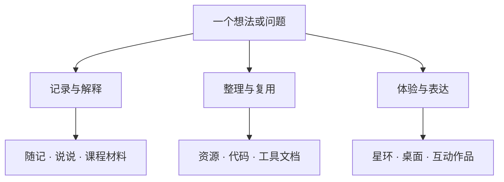

## 01 · 这个空间在记录什么 {#purpose}

LiuYinChu'Space 是一个个人网站。研究、编程、工具、生活和审美在这里并排出现：有些事情适合写成一篇完整的文章，有些只需要随手记下一段话；有些经验值得整理成资源，有些想法则需要真的做成一个可以使用、可以玩、可以继续修改的东西。

关于页的打字机里有一句话：**「记录，为了更深刻地思考。」** 这也说明了网站里长文、笔记和项目文档的关系。写下来，是为了把当时理解的事情整理清楚；做成工具，是为了让反复发生的工作变得更顺手。它们不必在第一次发布时就成为最终答案。

网站也保留了很个人的表达：流萤、角色与风景图片、诗句、音乐、星空，以及带有游戏感的小作品。关于页里「流萤厨献给流萤的真挚情书！」和「Explore unknown possibilities.」这些句子，把喜爱与探索直接写在了界面里。这里既容纳严肃的推导，也容纳不以实用为唯一目的的尝试。

### 内容、工具与实验，放在一起 {#purpose-1}

从现有内容可以看到三条相互交织的线：

- **记录与理解**：随记、说说、课程材料、实验报告和方法说明。
- **整理与复用**：资源目录、项目仓库、数据分析与排版工具的介绍。
- **体验与表达**：星穹文库、Portal 桌面、无手织机、小游戏和访客地球仪。

它们共用一座网站，但不要求长成完全相同的页面。阅读页把空间留给正文，工具页把操作和结果放在眼前，实验作品则允许画面、声音和动作成为内容本身。

## 02 · 全站的结构与视觉语言 {#structure}

### 六个主要栏目 {#structure-1}

顶部导航用六个栏目组织日常访问。它们是内容的入口，不是严格的学科分类。

| 栏目 | 内容与作用 |
| --- | --- |
| 随记 | 成篇的记录、科研与技术笔记、学习整理和生活思考。 |
| 说说 | 日常片段、想法与吐槽，保留思考刚发生时的样子。 |
| 资源链接 | 按主题归拢资料、网站、文件与工具，也保留带推荐理由的长文。 |
| 代码与项目 | 项目介绍、仓库入口、课程材料，以及可以在站内使用的实验和小游戏。 |
| 赛博会客厅 | 访客信息与地球仪、朋友们的个人站点。 |
| 关于 | 网站说明、自我介绍与学术页面的入口、版权和素材致谢。 |

Portal 和 AI 前沿使用各自独立的页面外壳；论文刷卡也采用沉浸式舞台。它们属于这座网站，但有自己的操作方式和视觉节奏。

### 页眉、页脚与当前位置 {#structure-2}

点击左上角的头像与站名可以回到首页。导航会标出当前所在栏目；阅读时向下滚动，页眉会收起，上滑时重新出现，为正文让出空间。手机端把栏目收进菜单，展开后背景暂停滚动，选定页面后菜单关闭，也可以用 Escape 退出。

页脚重新列出主要栏目与部分下级页面，放置 GitHub、Email 和版权信息。它承担的是读到页面末尾后继续浏览或联系站主的作用。

### 统一底色，各自表达 {#structure-3}

主站以 Catppuccin Mocha 的深色为基底，蓝、青和淡紫承担强调、链接与层次提示。细边线、圆角、低亮度光晕和半透明表面反复出现。中文长文中常用的文楷、今楷类字体，与代码和标签的等宽字体形成区别；实际字形会受设备和字体加载情况影响。

一致性主要体现在导航、颜色和操作习惯上，而不是让每个页面共用一套画面。随记像杂志索引，星穹文库像夜空中的书架，Portal 像桌面，课程页更接近有侧栏的讲义，无手织机则是一件可以触碰的生成作品。

## 03 · 首页：先看见主题，再进入内容 {#home}

首页是一组纵向展开的图片分区：Welcome、随记、资源链接、代码与项目、赛博会客厅、关于。文字在图片两侧交错出现，背景上的渐变遮罩为标题和说明保留对比度。首屏下方的箭头可以带你进入随记分区。

这套布局给每个栏目留出一个相对完整的画面：先用图片与一句说明建立印象，再进入实际内容。首屏图片优先呈现，后面的图片随浏览加载，不需要一开始就看见整座网站的所有细节。

### 开场动画的含义 {#home-1}

开场会出现 Hi、Space、Journey 等单词，最后停在 Welcome；上方的细条跟随动画推进。它是欢迎画面的一部分，**不表示文章、项目或全站资源的下载进度**。

是否播放会受到当前访问与历史状态影响，不应把它理解成每次都必须看完的启动仪式。开启系统「减少动态效果」时，这段开场会跳过。

## 04 · 随记：怎样找文章，怎样读文章 {#journal}

### 索引页的几个层次 {#journal-1}

随记索引把诗句、说说摘要、搜索、精选和文章卡片放在同一页。上面的内容偏向发现，下面的列表适合有目标地查找。

说说摘要条从说说内容中提取标题和首段，按节奏轮换。可以用滚轮、左右方向键或触屏横滑查看；鼠标悬停、键盘聚焦时会暂停，减少动态效果时不自动切换。点击摘要进入的是说说总页。

精选文章使用单独整理的清单，配有主题标签、标题和日期。宽屏上可以自动横向移动，也能暂停、继续或用 Shift 配合滚轮浏览；窄屏以手动横向滑动为主。它和下方列表中被放大的主卡是两件事：主卡会从当前页文章中选出，不能把「卡片更大」理解为「作者推荐程度更高」。

### 搜索、全部目录与分页 {#journal-2}

搜索会即时匹配文章的标题、摘要、作者和日期，并显示结果数量。修改关键词会回到第一页；清空搜索可恢复列表。这是文章信息检索，**不会搜索正文的每一句话**。

「全部目录」列出所有文章与日期，不受当前搜索结果限制。选定一篇、点击外侧或按 Escape，都可以收起目录。文章列表每页七篇，用页码或上一页、下一页切换。

版式上，一张大封面主卡与两张侧卡形成上方的重心，其余文章接在下面。封面负责辨认，标题和摘要负责判断内容是否值得继续读，日期则保留记录发生的时间。

### 文章页的阅读信息 {#journal-3}

进入正文后，先看到封面、标题、作者、发布日期和预计阅读时间。阅读时间只是根据正文长度估算的参考；技术推导、公式和代码需要停下来理解时，实际用时会更长。

目录由正文的一至三级标题生成。宽屏下吸附在正文右侧，滚动时高亮当前章节；点击条目可跳转，当前条目也会尽量留在目录可见区域内。窄屏下目录移到正文前，默认折叠，可以手动展开。

### 两种排版，内容相同 {#journal-4}

随记文章默认使用原版排版。目录顶部的小按钮显示当前模式，点击后保存选择并刷新页面，再次点击可以切回。

| 原版 | Enhanced |
| --- | --- |
| 保留文楷、今楷类字体的书写感，蓝色标题、青色强调与较明显的装饰。 | 使用系统无衬线字体，收窄长文阅读宽度，减轻标题、阴影与代码窗口装饰。 |
| 与主站原有长文风格相接近。 | 更克制地安排正文、链接和段落层次。 |

两者展示同一份内容，公式、代码、图示与脚注等能力仍然保留。这个开关只用于随记文章，不改变说说、项目介绍、资源页或这份说明书，也不等同于全站明暗主题。偏好保存在当前浏览器中。

## 05 · 文字之外：阅读组件与细节 {#reading-components}

技术文章不只有段落。网站的 Markdown 渲染工具把公式、代码、图示和补充信息放进同一篇内容里，尽量让它们保持清晰的阅读关系。这份说明书也直接使用这些组件，下面的示例可以操作。

### 代码：看清楚，也带得走 {#reading-components-1}

代码块按照识别到的语言着色，顶部显示语言标签与 Copy 按钮；复制成功后会给出反馈。超出阅读栏宽度的代码可以在块内横向滚动。

```python
values = [1, 2, 3]
mean = sum(values) / len(values)
print(mean)
```

这段代码展示的是阅读与复制方式，不会在网页中执行。不同设备的剪贴板权限也可能影响复制。

### 公式、图示与宽内容 {#reading-components-2}

行内公式用于连接一句话里的数学含义，例如 $y = G(s)u$；独立公式则给推导留出完整一行：

$$
\bar{x}=\frac{1}{n}\sum_{i=1}^{n}x_i.
$$

较长的公式可以横向滚动。Enhanced 中，普通行内公式保持在文字基线上；只有确实超出阅读栏宽度的公式，才需要独立的可滚动区域。

Mermaid 图示可以把关系和流程直接画在正文里。下面是这座网站几种内容形态的示意，不是一个需要离开本页的导航：



宽表格和图示也允许在各自区域内横向浏览。图片会按容器缩放并按需加载，有替代说明时可显示为图注；有链接的图片保留跳转行为。普通图片并不默认带有放大灯箱或编辑功能。

### 提示、折叠与隐藏答案 {#reading-components-3}

提示块把旁注、技巧、疑问等内容从主叙述中轻轻分开，不必把每一次补充都写进同一个长段落。

::alert{type="tip" title="这一块就是提示组件"}
遇到补充说明时，可以先读主线，再回来看提示。它保留在同一篇文章中，不需要再打开一页。
::

::folding{title="展开看看：为什么需要折叠内容？"}
长文章有时需要同时照顾第一次阅读和准备深入查阅的人。推导细节、补充例子或阶段性的记录可以放在折叠区，让主线先保持完整；需要时再展开。

折叠只是展示方式，不是权限控制。内容不会因为收起就变成私密资料。
::

模糊内容组件也采用类似思路：点击后显示，再次操作可隐藏。它适合暂时藏起答案或剧透，同样不承担保护信息的作用。

### 给不同信息不同形状 {#reading-components-4}

| 组件 | 阅读中的作用 |
| --- | --- |
| 对话 | 区分不同发言者，把问答或交流过程保留下来。 |
| 时间线与步骤 | 分别表达时间上的变化，以及需要依次完成的过程。 |
| 图库与分栏 | 并排展示图片或短内容；窄屏会收成单列。 |
| 徽章、标记与进度条 | 提示局部状态或强调片段；具体含义由文章内容决定。 |
| 链接卡与流光按钮 | 为关联内容提供更明显的入口，适合偶尔强调一次行动。 |
| 任务清单 | 展示条目的完成状态；文章内的清单不等同于 Portal 的个人待办。 |
| 脚注 | 把出处和旁注放到文末，并保留返回正文的路径。 |

脚注可以这样出现在一句话后面。[^handbook-demo] 标题也有定位锚点，长文可以按章节阅读；窄屏会隐藏标题旁的部分装饰图标，目录导航仍可用。

[^handbook-demo]: 这是说明书的脚注示例。点击返回箭头，可以回到刚才阅读的位置。

这些能力不意味着每篇内容都需要用满。短文可以只有文字；需要解释复杂关系时，再使用能帮助理解的形状。「Markdown Component Lab」专门把组件效果与可复制语法放在一起，是组件手册，不是在线编辑器。

## 06 · 说说与星穹文库：两种不同的节奏 {#talk-and-library}

### 说说：保留未必成篇的时刻 {#talk-and-library-1}

说说以「时代正疾驰而过」作为题头，集中放置日常、想法和吐槽。大图与简短副标题先建立气氛，后面则是一份连续可读的内容。它没有要求每个片段都变成一篇有结论的文章。

这里也会使用对话、隐藏答案、折叠、步骤、图库和关联文章卡，让不同长度的记录有合适的位置。它是站主发布的内容页，不是面向访客的发帖表单或留言板。旧专题可能继续作为历史记录保留，例如早期 AI 相关碎碎念已经注明由 AI 前沿接续。

### 星穹文库：同一批文章，换一种找法 {#talk-and-library-2}

星穹文库与经典随记使用同一份文章目录，打开后仍然进入同一篇正文。区别在浏览过程：它把文章放进星野、封面与时间的关系中。

搜索同样匹配标题、简介、作者与日期；页面显示文章总数、年份跨度和最近日期。这里提供两种视图：

- **星环漫游**：封面分布在三维圆环上。可以拖拽、滚轮滚动、触控板横滑或使用左右方向键；星环获得焦点后，Enter 打开正前方文章。下方的标题和序号帮助辨认当前落点。
- **时间航线**：按年组织文章，年份导航跳到对应位置。日期、作者、摘要和封面保留在纵向列表里，更适合回顾某一阶段的记录。

宽屏通常先呈现星环；窄屏、触屏或减少动态效果时更倾向时间航线，仍可手动切换。背景星星、闪烁、视差和流星提供气氛；减少动态效果会改用静态星野，页面在后台时暂停动画。

这里的设计重点是给「发现一篇文章」另一种过程，同时保留清晰、可检索的时间列表。看过星环以后，仍能回到熟悉的经典索引。

## 07 · 资源链接：目录与推荐理由 {#resources}

### 六个分类，两个查找层次 {#resources-1}

资源分为文献、编程、计算机、资料、工具和文件。总目录以卡片并排呈现各类内容，条目带编号，分类标题与 View All 进入更完整的分类页。

总目录顶部的搜索匹配资源名称，支持上下方向键选择结果、Enter 打开。进入分类详情后，检索范围扩展到名称、正文说明、补充信息与网址，并显示筛选条数。因此，知道名字时可以从总目录找；只记得用途时，可以在对应分类里进一步搜。

| 分类 | 主要整理方向 |
| --- | --- |
| 文献 | 百科、知识文库、科研开放数据与技术文档等参考入口。 |
| 编程 | 语言学习、开发环境、教程与代码工具。 |
| 计算机 | 系统、软硬件、网络与使用经验相关材料。 |
| 资料 | 跨主题的参考材料和知识集合。 |
| 工具 | 学习、研究和日常工作中可使用的应用或服务。 |
| 文件 | 清单、报告、课程笔记、作业与模板等资料入口。 |

分类详情把导航与搜索放在侧边，把编号、名称、Open 入口、主要说明和补充说明放在正文区域。它不只保存一个地址，也为「为什么存下它」留了说明空间。文件分类是资料链接集，没有上传、在线编辑或文件管理器。

### 还保留一份长文资源推荐 {#resources-2}

较早的资源推荐页仍然存在。它按照文章的方式介绍文献网站、编程学习、计算机环境、科研资料和工具，适合顺着推荐理由阅读。它与新的分类目录并存：一份偏重叙述，一份偏重查找。

资源页延续暗色基底、文楷字体和紫蓝强调色。目录用多列提高浏览密度，详情用细分隔线和正文面板放慢节奏。外部网站的内容与可用性由各自维护者决定。

## 08 · 项目与研究材料：从记录到复用 {#projects}

### 项目目录怎样组织 {#projects-1}

代码与项目页把内容分为全部、代码、项目和巧思，可以同时使用分类与关键词筛选。搜索匹配名称和简介；卡片根据实际信息显示项目主页、GitHub 等入口。

这是一份混合目录：有些条目是站内说明，有些是可以操作的网页作品，也有些只提供外部仓库或独立网站。比如「云海之上」指向外站游戏，「引力波数据处理入门学习与实践」提供的是仓库材料。

深空背景、噪点、玻璃介绍卡和跟随鼠标的卡片光照，让目录保留作品展示的感觉；名称、分类和简介仍是判断内容的主要依据。贡献图展示的是提供给页面的图像，不是要求访客操作的控件。

### 实验报告与 CoLab 系列 {#projects-2}

实验报告页按基础物理实验、近代物理实验和合作项目整理资料，说明中涉及 PDF、TeX、处理代码与测量数据。它明确希望减少整理报告的重复劳动，改善实验学习体验，也给后续探索留下可以复用的起点。

这类材料把一次实验的结果、表达方式与处理过程放在一起。页面中的计算物理企划是主题说明，不能把列表中的每一个主题都当作已经能在线运行的仿真。

### 现代控制课程 {#projects-3}

现代控制课程有独立的讲义布局：页首课程标识、侧栏目录、中英切换与明暗切换。滚动时目录标出当前章节，语言与主题选择保存在当前浏览器。

内容从质量、弹簧、阻尼系统建模延伸到三自由度主动隔振，讨论解耦、可控可观、Kalman 方法、MIMO，以及 KF、LQG、H∞ 等设计方法，并提供统一评价、绘图与作业提交的说明。页面承载的是课程阅读和实践材料，计算工作仍需在相应环境中完成。

中英文是分别编排的内容，并不是即时翻译；两种语言的详略也可能不同。浅色模式的灰绿纸面、深绿页首和蓝金强调，以及相应暗色模式，为系统阅读提供了与主站不同的气氛。

### precision-physkit {#projects-4}

precision-physkit 的页面是科研分析工具包的文档入口，介绍数据身份与处理溯源、预处理、谱估计、拟合、优化、峰分析和科研绘图，并配有安装方式、参数、边界与示例。

这里强调的是让一次分析的来源、步骤与输出能够被理解和复用。网站负责展示说明与代码，不会在浏览器里替访客执行这些分析。

### Ysy Data Analysis Helper {#projects-5}

这组工具围绕科研绘图与数据处理组织。文档介绍 MamPlotly、线图与散点绘制、临时样式组合、科研排版及 SVG 输出，明确采用「薄封装、减少样板代码、保持风格一致」的方向，与熟悉的绘图库配合。

不同部分的成熟度不一样：YiLPSD 标为实验版，WelchPSDHelper 标为开发中；部分相关在线工具入口仍是占位。阅读时应以具体模块的说明为准，而不把整个介绍页当成一套已经完备的在线分析平台。

### Brisk Nexus 与 LaTeX 模板 {#projects-6}

Brisk Nexus 把几项小作品放在一起：Linux 服务器登录欢迎脚本、Clebsch–Gordan 系数表生成器，以及基于 YsyClass 的 LaTeX 模板。页面讲用途、背景和使用方式，再把代码交给相应仓库。

独立的 Ysy LaTeX 页面目前仍只有题头与简短占位文字，完整介绍尚未展开；现有模板说明主要在 Brisk Nexus 中。模板版本与旧示例可能不同，使用时应核对文档里的版本说明。网站没有在线 LaTeX 编译器。

## 09 · 可以动手的作品与小工具 {#interactive-works}

### 生命树：现在是一台「无手织机」 {#interactive-works-1}

「生命树」这个入口目前呈现的是无手织机：一个在页面里持续织出布面的生成作品。细密彩线位于近黑色舞台中，暗角、颗粒和纸色档案区把即时变化与留下的记录区分开。

你可以选择四种纬线倾向，织一梭，在经线上拨弦，在已经织出的布面上打结，也可以主动开启合成声音。页面同时展示张力、梭数、来访和互动记录，以及布卷账本。

无人操作时，作品仍按自己的规则换线、织造和生成句子。离开到后台时动画暂停并保存，回来时进行有限补织。少量记忆保存在当前浏览器，可以继续上一段经历，也可以使用「拆掉这匹布」重新开始。

作品文本谈到继承旧版本机制、允许下一代改写。这个入口由此保留了持续迭代的意味；眼前的织造行为则是浏览器里的算法与交互，不是现场调用 AI 自动重写整个网站。

### Cyber Match：记忆与节奏 {#interactive-works-2}

Cyber Match 是翻牌配对游戏，提供 4×4、5×4、6×6 三种难度。每局随机抽牌并洗牌；连续配对成功形成 combo，失配会扣分并中断连击。面板显示得分、时间、轮数、准确率和配对进度。

各难度的最好成绩保存在本机浏览器，优先比较分数，同分时比较用时。近黑蓝色面板、带神秘感的牌面和玉绿、金、紫色的状态显示，让进度信息成为游戏画面的一部分。

### 2048：更直接的一局游戏 {#interactive-works-3}

2048 使用 4×4 棋盘，通过方向键或触摸滑动移动数字块，相同数字合并并计分。页面提供新游戏和结束后重试，焦点提示帮助区分控制棋盘与滚动网页。

深色圆角棋盘、多色数字块和背景光团保留了轻量游戏的气氛。目前棋盘与分数属于当前一局，不会保存为跨刷新进度或长期最高分。

### 学术绘图助手：先把尺寸算清楚 {#interactive-works-4}

绘图助手把输入和结果并排呈现：行数、列数、基准宽度、放大比例与子图高宽比决定布局尺寸，结果同时给出毫米、英寸和点，并提供字号、刻度字号与线宽建议。

下方的配色方案可以点击色块复制 HEX 色值。这是布局与配色的辅助工具，页面标明为测试版本；它不接收数据生成图像，也不提供在线导出完整图表。计算结果仍需要放回实际图中检查。

## 10 · 论文刷卡与 AI 前沿 {#papers-and-ai}

### 论文刷卡：把一批信息拆成一张张卡片 {#papers-and-ai-1}

论文刷卡隐藏主站页眉页脚，使用固定舞台、深色几何背景和带弹性切换的卡片。浏览过程从介绍卡开始，逐篇经过论文，最后到 Today’s Picks。

论文卡展示标题、作者、日期、主题，以及 Problem、Method、Result 等摘要信息。可打开 PDF、标记 Like、按页码跳转。滚轮或触摸滑动可以翻页；卡片获得焦点后，也可用上下方向键、Page Up / Page Down 和空格翻页。滚轮与触摸操作遇到卡内可滚动内容时，会先滚到边界，再切换卡片。

Like 按日期保存在当前浏览器。Today’s Picks 汇总选择；「I get」会复制选中的标题并清空当前资料日期的选择；Clear today 同样清除当前加载日期的选择，Clear all 清除全部本地收藏。如果资料回退到了前一天，这里的「当天」也对应那份资料的日期。

论文资料来自外部整理的数据源：先尝试当天内容，再回退前一天。这里负责阅读和挑选，不是在访客打开页面时现场抓取、理解并总结论文；数据缺失时可能没有可浏览条目。

### AI 前沿：独立的信息展示空间 {#papers-and-ai-2}

AI 前沿采用白灰、蓝紫为主的信息界面，有独立导航和页脚，也支持保存明暗偏好。总览把能力榜单与信息札记分开，榜卡展示评价方向、模型数量、排名与报告入口；详情结合档位、得分条和方法说明组织信息。

有多份榜单时，可以通过按钮、左右方向键或 Shift 配合滚轮切换；自动切换在悬停、聚焦、不可见或减少动态效果时暂停。只有一份榜单时，不会假装还有其他页可翻。

**这一部分目前仍处于演示与内容整理阶段。** 现有榜单头部与报告正文仍有待统一的内容，不能当作已完成核验的正式评测，也不代表全自动更新的新闻服务。界面已经展示出「先看结果，再看方法」的组织方式，内容的完整性则需要继续补齐。

## 11 · Portal：一台网页里的桌面 {#portal}

Portal 把网站与常用服务换成了桌面隐喻：纸飞机壁纸、顶栏、Dock、搜索覆盖层和带红黄绿控制钮的应用窗口。它让「找一个入口」与「做一点日常小事」可以发生在同一张桌面上。

### 桌面的玻璃与 Dock {#portal-1}

部分表面使用具有折射感的 Liquid Glass，后方壁纸会参与明暗与玻璃效果，文字和细边框仍保持清楚。鼠标靠近 Dock 时，邻近图标放大、抬起并让位；触屏、紧凑布局或减少动态效果时，不使用这种跟随效果。

这些细节服务于桌面的触感，但不要求所有设备显示完全相同。图形能力、减少透明度、高对比度等系统设置会影响呈现。

### 顶栏上的按钮各做什么 {#portal-2}

| 位置 | 实际作用 |
| --- | --- |
| 品牌图标 | 回到主站首页。 |
| File | 打开 Launchpad 网站列表。 |
| Edit | 在新标签页打开随记。 |
| Music / Weather | 打开音乐或天气窗口。 |
| Help | 打开 ChatGPT 外部网站。 |
| 搜索图标 | 打开 Spotlight 搜索。 |
| 控制中心样式图标 | 打开待办窗口。 |
| 网络图标 | 打开 IP 信息查询网站。 |
| 时钟 | 显示本地时间，点击打开日历。 |

电池图标属于界面展示，网络图标是入口；它们不测量设备电量、网络质量或实时系统状态。Dock 中的 AI 服务、代码平台、邮箱、网盘与翻译等图标也主要是快捷外链，不表示网站已经接入你的账户。

### 窗口管理的实际范围 {#portal-3}

待办、音乐、天气和日历是四个普通应用窗口，**同一时间显示一个普通应用**；换到另一个会替换原窗口。Spotlight 和 Launchpad 则是覆盖层，可以盖在当前窗口之上。

红钮关闭，黄钮最小化，Dock 可以恢复，绿钮最大化或还原。桌面宽度下可以拖动标题栏移动窗口；紧凑布局中不提供拖动和最大化。位置用于当前页面的还原过程，不会保存成下一次打开浏览器的桌面布局，也没有自由拉边缩放。

### Spotlight：聚合入口搜索 {#portal-4}

Spotlight 搜索静态页面索引、文章信息、项目、友链和六类资源。输入为空时显示默认入口；用空格分开的多个词共同参与匹配，结果按相关程度排序、按类别区分，最多显示十二项。

Ctrl 或 Cmd 配合 K 打开搜索；上下方向键选择，Enter 在新标签页打开结果，Escape 收起。它检索的是索引信息，不是整站文章正文。打开覆盖层后焦点留在面板里，关闭后回到原来的位置，方便键盘继续操作。

### Launchpad：按图标寻找常用网站 {#portal-5}

Launchpad 把预先整理的网站按组排成图标网格，可以按名称或网址筛选。打开条目后进入新标签页，面板收起。它展示的是站点维护的快捷清单，没有供访客新增、重排或编辑图标的设置界面。

### 音乐：由你开始播放 {#portal-6}

音乐窗口展示播放器与曲目列表，不会自动播放。最小化后播放器仍保留，打开 Spotlight 或 Launchpad 也不会关闭音乐；但关闭音乐窗口或改开另一个普通应用时，播放器会结束。

因此它是一台桌面中的音乐窗口，而不是贯穿全站、跨页面持续播放的背景音乐。网站也不承诺刷新后恢复到上次的曲目和进度。

### 天气：珠海的一扇小窗 {#portal-7}

天气窗口显示珠海的当前天气，包括温度、体感、风速、湿度，并在数据提供时显示气压与能见度。信息来自在线天气服务，窗口打开时请求。

它固定展示珠海，不跟随访客所在地，也没有切换城市或查看未来预报的操作。服务不可用时会显示错误状态。

### 日历与待办：共享日期，各自操作 {#portal-8}

日历使用六周月历，可以前后换月、回到今天、选择日期。Notice 标红日期，Cancel 取消标记，已标记日期也会出现在列表中。选中日期与标记保存在本机浏览器。

日历获得焦点后，可以用左右方向键移动一天、上下移动七天，PageUp / PageDown 换月，Home / End 到月首或月尾，T 回到今天。键盘操作要以当前焦点所在区域为准。

待办支持通过加号或 Enter 新增、勾选完成、删除任务。Total Task 查看全部；Daily Task 查看选定日期的任务。每日模式新增任务会带上日期，全部模式新增的无日期任务显示为 Ever。

日历与待办共享所选日期。可以先在日历中选择一天，再打开待办并切到 Daily Task；不需要假设两个窗口会同时存在或自动替你切好模式。任务、模式与日期保存在当前浏览器，没有账号系统或跨设备同步。

## 12 · 赛博会客厅：来访与串门 {#lounge}

会客厅用大标题、引文、图片、显示器边框和编号节点卡片组织两个入口：访客中心与网络邻居。它把访问者与朋友的网站放在一起，以「会客」表达交流的意愿；当前并没有在线聊天室、多人房间或留言表单。

### 访客中心看到了什么 {#lounge-1}

访客中心展示日期、IP、地区、浏览器、系统与时区。地区来自 IP 的粗略定位，设备信息来自浏览器提供的标识，不是通过 GPS 得到的精确位置。

地球仪展示陆地与国界轮廓、经纬网和当前坐标标记。按住拖动可以旋转，「定位到访客」可以重新对准当前坐标。向下滚动时，地球逐渐放大、上移、变清晰，前景文字变淡，访问本身也变成了一个观看过程。

定位服务失败时，页面会说明不可用，并使用珠海作为地球的默认位置。它不是全球其他访客的实时散点图，也没有展示所有人的历史足迹或访问热力分布。

### 网络邻居的节点感 {#lounge-2}

网络邻居以卡片展示朋友的站名、简介和图标，点击后在新标签页访问。NEIGHBOR NODE、OPEN、扫描线和错峰进入的动效，把一张友链表做成了彼此连接的节点。

站点图标加载失败时会尝试替代来源，最后使用文字或默认图案，让链接信息仍然可辨认。页面也写明了交换友链的要求和需要提供的信息，并提示通过 Issues 提交；这是一份交流说明，不是站内在线申请系统。

## 13 · 关于、署名与未完成的部分 {#about-and-credits}

### 关于页为什么从打字机开始 {#about-and-credits-1}

关于页先呈现逐字输入与删除的文字，再进入编号目录。欢迎、流萤、探索、记录、代码与提示词交替出现，比一上来列身份更先表达这个空间的语气。点击文字可以推进当前阶段，页面在后台时会暂停等待。

宽屏上可以用滚轮、方向键、Page 键、空格或手势切换开场与目录。窄屏和较矮窗口使用原生滚动，避免固定画面把内容裁掉。

当前目录是 01 网站说明书、02 自我介绍、03 学术主页、04 版权说明。**自我介绍和学术主页目前保留入口，但对应页面暂未开放。** 本文不会把这些预留位置写成已经能完整访问的内容。

### 不同内容，分别说明使用约定 {#about-and-credits-2}

版权页将网站描述为非盈利、非商业的个人博客，并按内容类别给出约定。下面是对该页面声明的归纳：

| 内容 | 网站版权页的表述 |
| --- | --- |
| 前端代码 | 使用 MIT 许可，复用时保留原始版权声明，按原样提供。 |
| 原创图片 | 允许任意形式使用。 |
| 原创文章与日志 | 使用 CC BY-NC-ND 4.0，要求注明出处，禁止商用及修改。 |
| 第三方图片与素材 | 保留来源与创作者致谢，不能把本站原创内容的许可直接套用到它们身上。 |

具体使用时，以版权页与相应作品标注的原文为准。版权页还列出了朋友的网站、部分产品与品牌作为设计参考；这是一份灵感与帮助的致谢，不意味着每一张页面都来自同一种风格。

### 网站也允许有空白 {#about-and-credits-3}

项目占位页、开发中的工具、演示榜单，以及还没有开放的个人页面，都是当前网站状态的一部分。完整地介绍它们，也包括说明它们做到哪里，而不是把计划写成完成。

访问未匹配的地址时，404 页面会展示当前路径，并提供首页、随记、资源和项目等去向。它把访问中断变成一次重新选择入口的机会。

## 14 · 设备、记忆与使用边界 {#devices-and-memory}

### 手机与键盘也是正常的阅读方式 {#devices-and-memory-1}

窄屏会收起主导航、把文章目录移到正文前，将图库和分栏变成单列，并让 Portal 使用紧凑窗口。星穹文库更倾向时间航线，长表格、代码与公式保留内容内部的横向滚动。

不少界面支持键盘：文章与资源搜索、星环、Portal 覆盖层、日历、刷卡和小游戏都有各自的操作方式。请先关注当前焦点在哪个区域，同一方向键在正文、日历与棋盘里有不同含义。

### 动效提供气氛，也需要让路 {#devices-and-memory-2}

首页开场、精选条、说说摘要、星空、Dock 和部分按钮都考虑了系统「减少动态效果」偏好，一些效果会停下，一些会换成更简单的呈现。若页面在后台，多项持续动画也会暂停。

这些处理的共同方向，是让动效可以帮助辨认、切换和建立气氛，同时保留安静浏览的方式；不代表所有页面都在所有设备上使用完全一样的降级策略。

### 哪些东西会被记住 {#devices-and-memory-3}

| 内容 | 当前保存方式 |
| --- | --- |
| 随记排版、课程语言与主题、AI 前沿主题 | 当前浏览器的本地偏好。 |
| Portal 待办、日历选中日期与标记 | 当前浏览器的本地记录。 |
| 无手织机的部分记忆、Cyber Match 各难度最好成绩 | 当前浏览器的作品与游戏记录。 |
| 论文刷卡的 Like | 当前浏览器中按日期保存。 |
| Portal 窗口位置与音乐进度、2048 棋盘 | 当前页面或当前实例内的状态，不是长期同步记录。 |

换设备、换浏览器或清除站点数据，都可能使本地记录不再出现。这里没有统一账户与云端同步，也不应把这些轻量功能当作唯一的数据存放位置。

### 页面与外部服务各有分工 {#devices-and-memory-4}

字体、数学排版资源、网站图标、天气、IP 定位和论文数据等部分内容需要网络服务。正文、交互和这些外部信息的加载速度可能不同；某个服务失败，也不等于整座网站都失去作用。

这份说明书描述的是现在已经做出来的体验，以及页面明确表达的想法。随着文章、工具和作品继续变化，它也需要一起修订：让后来的人不仅知道哪里可以点，还能看懂这个空间是怎样被一点点做出来的。
